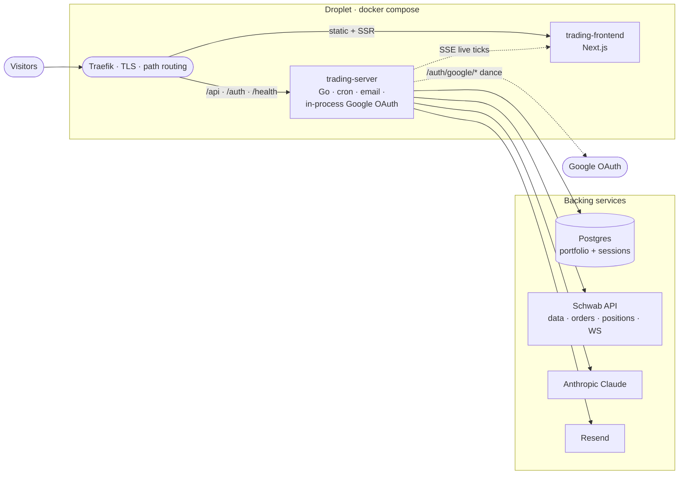
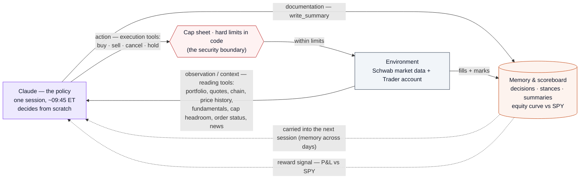

# vibetradez.com

An AI runs a single personal brokerage account. Each session Claude decides from scratch what to do with the money (buy equity, buy options, trim, sell, or hold cash), sizing each move within hard caps enforced at the tool layer and holding positions across days. The mandate is to grow the account, benchmarked against buy-and-hold SPY. This is one account, not a multi-user product. Subscribers watch and get a daily recap email.

> The autonomous portfolio manager is the whole system. It runs whenever `TRADING_ENABLED=true` and trades **live** with real money against the Schwab Trader API — there is no paper mode. (The original three-pick options bot has been removed.)

## Related repos

- [jaycebordelon.com](https://github.com/JayceBordelon/jaycebordelon.com): personal portfolio and blog. Standalone deployable, planned to run on its own droplet.

Google OAuth is handled in-process by the trading-server binary at `/auth/google/start` and `/auth/google/callback`. The Google Cloud Console redirect URI is `https://vibetradez.com/auth/google/callback`.

## Architecture



Visitors hit Traefik, which routes by path: `/api`, `/auth`, and `/health` go to the Go trading-server, everything else goes to the Next.js trading-frontend. The trading-server owns every outbound dependency: Postgres for the book (positions snapshots, decisions, the equity curve) plus users and sessions, Schwab for live quotes and the Trader API (orders, positions, account), Anthropic Claude for the portfolio agent, and Resend for email. Sign-in is a direct Google OAuth flow handled in the trading-server binary, and the session cookie is validated against a local sessions table on each `/api/*` request. The frontend does not talk to anything outside the droplet directly. Live ticks flow back to it as SSE from the trading-server.

## What's here

```
vibetradez.com/
├── server/                 Go API (portfolio agent, crons, Schwab, in-process Google OAuth, Resend email)
│   ├── cmd/scanner/         Main entry point, cron registration, daily lifecycle (main.go + portfolio.go)
│   ├── internal/
│   │   ├── portfolio/       v2 portfolio manager: cap sheet (the security boundary), tool layer, agent loop, prompt
│   │   ├── portfoliowire/   Adapters binding the portfolio agent to Schwab + exec + store
│   │   ├── exec/            Broker layer: equity + options orders, positions, account, portfolio entry points
│   │   ├── schwab/          Schwab OAuth + Market Data + instruments (market cap) + streaming client
│   │   ├── store/           PostgreSQL data layer (portfolio_* tables, subscribers, sessions, transcripts)
│   │   ├── server/          HTTP API handlers (/api/portfolio*, SSE /api/quotes/stream, health)
│   │   ├── templates/       HTML email templates (daily portfolio recap, Schwab re-auth nag, one-time launch announcement)
│   │   ├── auth/            In-process Google OAuth (users + sessions in a dedicated Postgres pool)
│   │   ├── calendar/        NYSE holiday + half-day calendar, market-hours math
│   │   ├── quotes/          Live-quotes hub (Schwab WS to SSE fan-out)
│   │   ├── config/          Environment variable loading
│   │   └── email/           Resend email client
│   ├── Dockerfile
│   └── go.mod
├── client/                  Next.js frontend (Next.js 16, shadcn/ui, Recharts v3)
│   ├── app/                 App Router: /, /dashboard, /holdings, /closed, /transcripts/[date], /faq, /terms, /privacy
│   ├── components/          Portfolio dashboard, holdings + closed lists, trade detail, layout, subscribe
│   ├── hooks/               Custom React hooks (live quotes via SSE, market status)
│   ├── lib/                 API client, formatters
│   ├── types/               TypeScript interfaces (portfolio.ts, trade.ts)
│   └── Dockerfile
├── local/                   Self-contained Docker stack with seeded Postgres for offline dev
├── docker-compose.yml       Production stack (traefik + trading-server + trading-frontend)
└── .github/workflows/       PR checks: lint + build + test on every PR
```

## Tech stack

| Component | Choice |
|---|---|
| Server | Go 1.25, PostgreSQL (DO managed), Anthropic Claude (claude-opus-4-8), Schwab Market Data + Trader API, Resend email |
| Client | Next.js 16, React 19, Tailwind CSS v4, shadcn/ui (new-york), Recharts v3, TradingView Lightweight Charts |
| Auth | In-process Google OAuth (`golang.org/x/oauth2`), sessions in a dedicated Postgres pool |
| Live data | Schwab WebSocket Streamer API, fanned out to browsers via SSE |
| Infra | Docker Compose, Traefik v2.10 (in-repo), Let's Encrypt, Digital Ocean Droplet |

## Daily lifecycle (v2 portfolio manager)

Read the day as an **agent–environment loop**, the way an RL environment is drawn: Claude is the policy, the market and the brokerage account are the environment, the reading tools are observations, the execution tools are actions (gated by the cap sheet), and the equity curve versus SPY is the reward signal. There is no training loop here, though: the policy is fixed within a session, and "memory" is the prior decisions, stances, and summaries it reads back the next day, not weight updates.



Three crons (`robfig/cron`, America/New_York, skipping weekends and holidays) drive the loop, registered whenever `TRADING_ENABLED=true`. The account trades **live** — there is no paper mode.

- **~09:45 ET — the session.** Claude observes the live book through the reading tools and decides from scratch: buy equity, buy a call or put, add, trim, sell, cancel a stale order, or hold cash. Every action passes the cap sheet (the security boundary enforced in code) before it reaches the broker. The percentage caps are enforced at the tool layer, and the broker entry point adds only a flat absolute fat-finger ceiling on the way out (it does not re-check the percentages, so the tool layer is the sole enforcement point for the percentage policy). It closes the session with `write_summary`; the moves, stance, summary, and the full tool-by-tool transcript are persisted.
- **Every 15 min, market hours — the risk sweep.** Flags the drawdown breaker and held options near expiry (detect + log).
- **16:00 ET — the close.** Records the equity-vs-SPY snapshot and the held book, then sends the **single daily recap email**: the day's summary, every move with its reason, the closing book and headline numbers, and a link to that day's full transcript on the site.

## Hard caps

Every cap is a percentage of live account equity read at the start of the session, so the policy scales with the account. The values live in `internal/portfolio/caps.go` (`DefaultCaps`) and are enforced at the tool layer. The broker entry point re-checks only a flat absolute order-cost ceiling (`exec.MaxPortfolioOrderCostCeiling`), not these percentages, so the tool layer is the sole enforcement point for the percentage policy.

| Cap | Value | Why |
|---|---|---|
| Max per underlying | 40% of equity | Allows real conviction, blocks all-in on one name (equity and options on the same name count together) |
| Options premium sleeve | 50% of equity | Options are the leverage sleeve, capped so a vol crush cannot wipe the account |
| Per-order notional | 30% of equity | One order cannot deploy the whole book |
| Daily new deployment | 75% of settled cash per session | Paces buying across days without forcing an all-in morning |
| Drawdown breaker | new buys halt at -35% from the high-water mark | Stops averaging down into a crater (de-risking stays allowed) |
| Liquidity floor | stock >= $5, market cap >= $2B, option OI >= 500 and volume >= 100, spread <= ~10% | No penny stocks, no dead chains |
| Settled-cash rule | new buys spend settled cash only | Avoids good-faith and free-ride violations on T+1 |

Selling and trimming are always allowed, including while the drawdown breaker has paused new buys.

## Local development

```bash
cd local
docker compose -f docker-compose.local.yml up --build
# http://localhost:3001
```

The self-contained local stack boots Postgres, the Go server, the Next.js frontend, and the mocked auth service with seeded data. Stub keys are baked in so the server starts without real Claude / Schwab / Resend calls, and the cron jobs are pushed to Sunday so they never fire.

For a server-only build:

```bash
cd server
go test ./...   # requires local Postgres at TEST_DATABASE_URL (defaults to dev string)
go build ./...
```

For client-only dev (against a remote server):

```bash
cd client
npm install
npm run dev
```

## Database

PostgreSQL hosted on Digital Ocean Managed Databases. Schema auto-migrates on server boot (CREATE TABLE IF NOT EXISTS for new tables, ALTER TABLE ... IF NOT EXISTS for additive columns). The full migration history lives inline in `server/internal/store/store.go`'s `migrate()` function. The v2 tables are `portfolio_decisions` (every move and hold, each with a stable URL-safe `uuid` used as the trade id behind its detail route), `portfolio_positions` (the held-book snapshot), `portfolio_sessions` (the daily stance, synopsis, and action items), and `portfolio_equity_curve` (account equity vs SPY). Subscribers and the per-day session transcripts live alongside them.

## Environment variables

Required env vars are read from `server/.env` (loaded into the trading-server container via the docker-compose `env_file:` directive). Every required var causes the binary to `log.Fatal` on boot if missing, so a misconfigured container never serves traffic. See `server/.env.example` for the full list, including `TRADING_ENABLED` and the portfolio cron schedules.

The client does not have its own env file in production. The `API_URL` env var is set in the compose file to point at the trading-server's internal hostname.

## Model version refresh policy

The agent model is configured via the `ANTHROPIC_MODEL` env var with the default defined as the `DefaultAnthropicModel` constant in `server/internal/config/config.go`.

Any time work touches the portfolio agent or this default, fetch the official Anthropic Go SDK documentation and refresh the default to the current latest production model. Anthropic publishes new model versions regularly, and a stale default degrades quality silently. The page to read is:

- Anthropic Go SDK: <https://platform.claude.com/docs/en/api/sdks/go>

## Hostname routing

This service binds `Host(\`vibetradez.com\`)` plus the `www` subdomain via Traefik labels in `docker-compose.yml`. Route priority:

- `/api/*`, `/auth/*`, `/health` go to the trading-server (priority 20)
- everything else goes to the trading-frontend (priority 10)

Traefik runs as the `traefik` service in this same `docker-compose.yml` (TLS via Let's Encrypt) and shares the `vibetradez-network` bridge network with the two app services.

## API protection

All `/api/*` routes on the trading server require the `X-VT-Source` header. Without it, requests return 403. The Next.js frontend includes this header on every fetch call via its server-side API proxy.

## CI / CD

`.github/workflows/pr-checks.yml` runs on every pull request:

1. Biome on the client
2. `next build` on the client
3. gofmt / `go vet` / `go build` / `go test -race` on the server (with an ephemeral Postgres service container)
4. actionlint on the workflow files

Production deploys are handled by the operator's deploy pipeline (separate from this repo).

## UX/UI audits

Every PR that changes the frontend ships with a full **UX/UI audit**: a
full-page screenshot of each page at desktop (1440×900) and mobile (390×844), in
light and dark, with a written per-page analysis and any rendering bug it
surfaces fixed in the same PR. Audits are committed under
[`docs/ui-audits/`](docs/ui-audits/) (one dated folder per run) and embedded in
the PR description.

- **Latest audit:** [`docs/ui-audits/2026-06-08/audit.md`](docs/ui-audits/2026-06-08/audit.md)
- **Index + convention:** [`docs/ui-audits/README.md`](docs/ui-audits/README.md)
- **Capture pipeline:** [`scripts/ui-audit/`](scripts/ui-audit/) (Playwright)

Generate one against the local stack:

```bash
cd local
python3 generate-seed.py > seed.sql
docker compose -f docker-compose.local.yml -f docker-compose.local.override.yml down -v
docker compose -f docker-compose.local.yml -f docker-compose.local.override.yml up --build -d
cd ../scripts/ui-audit && npm install && ./run.sh
```

## Where the load-bearing logic lives

| Concern | Path |
|---|---|
| Cap sheet (the security boundary) + pure cap checks | `server/internal/portfolio/caps.go` |
| Portfolio tool layer (buy/sell equity + option, hold, reads) | `server/internal/portfolio/tools.go` |
| Portfolio agent loop + final-JSON stance parse | `server/internal/portfolio/agent.go` |
| Mandate prompt | `server/internal/portfolio/prompt.go` |
| Adapters to Schwab + exec + store | `server/internal/portfoliowire/wire.go` |
| Broker layer (equity + options orders, positions, account, portfolio entry points) | `server/internal/exec/` |
| Schwab market cap (instruments fundamentals) | `server/internal/schwab/instruments.go` |
| Portfolio crons (daily session, risk sweep, EOD snapshot) + email send | `server/cmd/scanner/portfolio.go` + `main.go` |
| Portfolio store tables + methods | `server/internal/store/portfolio.go` |
| Portfolio API endpoints | `server/internal/server/portfolio.go` |
| Daily recap email template | `server/internal/templates/portfolio_update.html` |
| Portfolio dashboard | `client/components/portfolio/` |
| In-process Google OAuth | `server/internal/auth/` |

## Common operations

### Re-authorize Schwab OAuth

Visit `https://vibetradez.com/auth/schwab` in a browser. Tokens are stored in the `oauth_tokens` table and auto-refresh.

### Check server health

```bash
curl https://vibetradez.com/health | jq
```

Returns per-service status for database, Anthropic, Schwab, and api with latencies. The Anthropic check goes through the official SDK and warns (instead of fails) when a stub local key is detected.

### Docker commands on production

```bash
ssh jayce@<server>
cd <project-path>
docker compose logs trading-server --tail 50    # View Go server logs
docker compose logs trading-frontend --tail 50  # View Next.js logs
docker compose restart trading-server           # Restart Go server
docker compose up -d --force-recreate trading-server  # Full recreate
```

## License

MIT. See [LICENSE](LICENSE). Use it, fork it, run your own. Contributions are welcome by PR, and opening one means you agree to license your contribution under the same terms.
