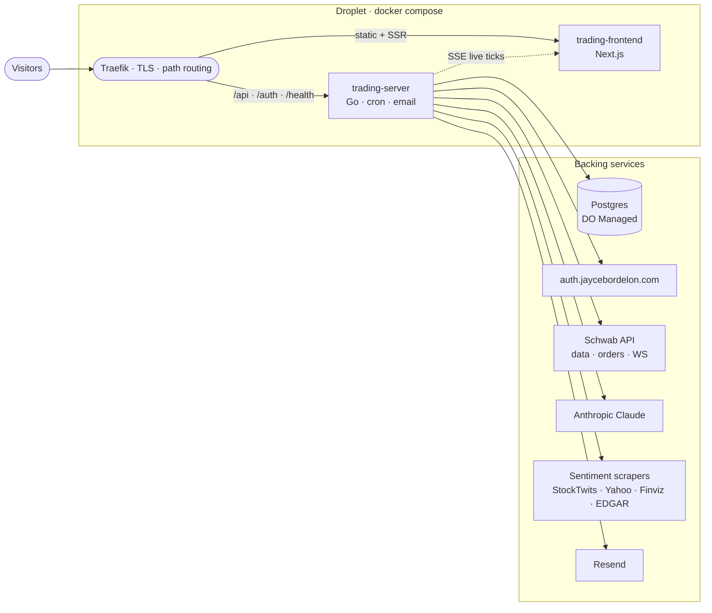
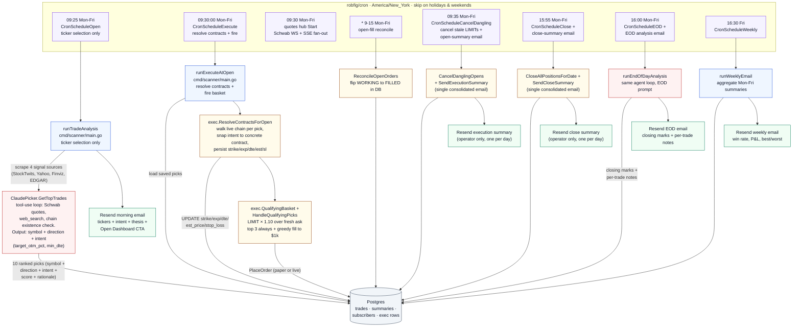

# vibetradez.com

AI-powered options trading service. A language model ranks 10 options contracts before the bell, the executor resolves each pick to a real contract at the open, and the top 3 auto-fire in a real Schwab brokerage account.

## Related repos

- [auth.jaycebordelon.com](https://github.com/JayceBordelon/auth.jaycebordelon.com) — centralized OAuth identity provider. The dashboard's "Sign in with Google" flow brokers through this service; every API request on `vibetradez.com` verifies its session cookie's token via `POST /oauth/verify` against it.
- [jaycebordelon.com](https://github.com/JayceBordelon/jaycebordelon.com) — sibling project on the same droplet (personal portfolio and blog).

## Architecture



Visitors hit Traefik, which routes by path: `/api`, `/auth`, `/admin`, `/health` go to the Go trading-server; everything else goes to the Next.js trading-frontend. The trading-server owns every outbound dependency: Postgres for picks / executions / summaries, [auth.jaycebordelon.com](https://github.com/JayceBordelon/auth.jaycebordelon.com) for token verification on each request, Schwab for live quotes + WebSocket ticks + Trader API orders, Anthropic Claude for the morning picker and EOD analysis, four sentiment scrapers for the morning signal aggregation, and Resend for email. The trading-frontend doesn't talk to anything outside the droplet directly; live option ticks flow back to it as SSE from the trading-server.

## What's here

```
vibetradez.com/
├── server/                 Go API (cron jobs, Claude picker + at-open contract resolver, Schwab market data, Resend email)
│   ├── cmd/scanner/        Main entry point, cron registration, daily lifecycle
│   ├── internal/
│   │   ├── calendar/       NYSE holiday + half-day calendar, market-hours math
│   │   ├── config/         Environment variable loading
│   │   ├── email/          Resend email client
│   │   ├── exec/           Auto-execution: ResolveContractsForOpen, selector, order placement, reconcile, close
│   │   ├── quotes/         Live-quotes hub (Schwab WS to SSE fan-out)
│   │   ├── schwab/         Schwab OAuth + Market Data API + streaming client
│   │   ├── sentiment/      Market signal aggregator (4 sources)
│   │   ├── server/         HTTP API handlers (including SSE /api/quotes/stream)
│   │   ├── store/          PostgreSQL data layer
│   │   ├── templates/      HTML email templates
│   │   └── trades/         Picker prompt + agent loop
│   ├── Dockerfile          Multi-stage Go build
│   └── go.mod
├── client/                 Next.js trading frontend (Next.js 16, shadcn/ui, Recharts v3)
│   ├── app/                App Router: /, /history, /terms, /faq, /trade/[symbol]
│   ├── components/         Dashboard, history, layout, subscribe, trade detail
│   ├── hooks/              Custom React hooks (live quotes via SSE, market status)
│   ├── lib/                API client, formatters, calculations
│   ├── types/              TypeScript interfaces
│   └── Dockerfile          Multi-stage Node.js build
├── local/                  Self-contained Docker stack with seeded Postgres for offline dev
├── docker-compose.yml      Two-service compose slice (trading-server + trading-frontend) with Traefik labels
└── .github/workflows/      PR checks: lint + build + test on every PR
```

## Tech stack

| Component | Choice |
|---|---|
| Server | Go 1.25, PostgreSQL (DO managed), Anthropic Claude Opus 4.7, Schwab Market Data + Trader API, Resend email |
| Client | Next.js 16, React 19, Tailwind CSS v4, shadcn/ui (new-york), Recharts v3, TradingView Lightweight Charts |
| Auth (external) | Brokered through [auth.jaycebordelon.com](https://github.com/JayceBordelon/auth.jaycebordelon.com) |
| Live data | Schwab WebSocket Streamer API, fanned out to browsers via SSE |
| Infra | Docker Compose, Traefik v2.10 (external), Let's Encrypt, Digital Ocean Droplet |

## Daily lifecycle

End-to-end flow of how a morning options pick goes from cron tick to filled position to subscriber inbox. Five crons own the day; the auto-execution basket is the only path that ever touches Schwab Trader.



Picker and executor are decoupled, and so are *ticker selection* and *contract selection*. The 9:25 cron runs the picker against live Schwab equity quotes plus web search; option-chain prices are explicitly NOT consumed there because US options don't trade pre-market and Schwab's `/chains` endpoint serves yesterday's closing print until 9:30:00. Claude's output is symbol + direction + score + thesis + contract intent (`target_otm_pct`, `min_dte`), saved to `trades` with the five contract-specific columns (strike, expiration, dte, estimated_price, stop_loss) left NULL.

At 9:30:00 sharp, the executor cron loads the saved picks, calls `ResolveContractsForOpen` to walk the live chain per pick and snap each intent to a real contract, `UPDATE`s the trade row with the resolved fields, and only then runs the basket selector. Resolved picks fire as LIMIT × 1.10 over the live ask (fire-and-forget). The 9:35 cron kills any LIMIT still WORKING and sends ONE consolidated open-summary email. The 15:55 cron sells every open position and sends ONE consolidated close-summary email.

## Auto-execution gating

If `TRADING_ENABLED=true`, the 9:30:00 ET execute-at-open cron loads the picks the 9:25 picker saved, runs `ResolveContractsForOpen` to fill in each pick's strike/expiration/dte/estimated_price/stop_loss against the live chain, and runs the *resolved* picks through the selector. Picks the resolver couldn't satisfy stay unresolved and the selector skips them. Two phases on the resolved set: top 3 always fire (per-contract cap at `MaxContractPremium` of $10/share), then greedy fill from picks 1-10 toward a `MaxDailyBasketUSD` of $1,000 of cumulative exposure. Duplicates land as one `quantity=N` order per pick.

| Constant | Value | Why |
|---|---|---|
| `GuaranteedBasketRank` | 3 | Phase 1 unconditional fires |
| `GreedyFillMaxRank` | 10 | Phase 2 walks ranks 1 through 10 |
| `MaxContractPremium` | $10/share ($1,000/contract) | Hard per-contract ceiling, applied both phases |
| `MaxDailyBasketUSD` | $1,000 | Phase 2 target only; phase 1 can overshoot |
| `LimitPriceMultiplier` | 1.10 | Buffer on live ask for the open LIMIT |

## Local development

```bash
cd local
docker compose -f docker-compose.local.yml up --build
# http://localhost:3001
```

The self-contained local stack boots Postgres + Go server + Next.js frontend + the auth service (mocked locally) with realistic seeded data. Stub keys are baked in so the server starts without making real Claude / Schwab / Resend calls; the cron jobs are pushed to Sunday so they never fire. Seed includes ~1 year of historical picks with EOD summaries.

For a server-only build:

```bash
cd server
go test ./...   # requires local Postgres at TEST_DATABASE_URL (defaults to dev string)
go build ./...
```

For client-only dev (against a remote server):

```bash
cd client
npm install
npm run dev
```

## Database

PostgreSQL hosted on Digital Ocean Managed Databases. Schema auto-migrates on server boot (CREATE TABLE IF NOT EXISTS for new tables, ALTER TABLE ... IF NOT EXISTS for additive columns). The full migration history lives inline in `server/internal/store/store.go`'s `migrate()` function.

## Environment variables

Required env vars are read from `server/.env` (loaded into the trading-server container via the docker-compose `env_file:` directive). Every required var causes the binary to `log.Fatal` on boot if missing, so a misconfigured container never serves traffic. See `server/.env.example` for the full list.

The client doesn't have its own env file in production; the `API_URL` env var is set in the compose file to point at the trading-server's internal hostname.

## Model version refresh policy

The picker model is configured via the `ANTHROPIC_MODEL` env var with the default defined as the `DefaultAnthropicModel` constant in `server/internal/config/config.go`.

Any time work touches the trade picker or this default, fetch the official Anthropic Go SDK documentation and refresh the default to the current latest production model. Anthropic publishes new model versions regularly; if the default sits stale, trade quality degrades silently. The page to read is:

- Anthropic Go SDK: <https://platform.claude.com/docs/en/api/sdks/go>

## Hostname routing

This service binds `Host(\`vibetradez.com\`)` plus the `www` subdomain via Traefik labels in `docker-compose.yml`. Route priority:

- `/api/*`, `/auth/*`, `/admin/*`, `/health` → trading-server (priority 20)
- everything else → trading-frontend (priority 10)

The Traefik container itself is not in this repo; it's expected to be running on the same Docker network (`app-network`, declared `external`) alongside these services.

## API protection

All `/api/*` routes on the trading server require the `X-VT-Source` header. Without it, requests return 403. The Next.js frontend includes this header on every fetch call via its server-side API proxy.

## CI / CD

`.github/workflows/pr-checks.yml` runs on every pull request:

1. Biome on the client
2. `next build` on the client
3. gofmt / `go vet` / `go build` / `go test -race` on the server (with an ephemeral Postgres service container)
4. actionlint on the workflow files

Production deploys are handled by the operator's deploy pipeline (separate from this repo).

## Trading service highlights

- **Two-stage picker / executor split.** Pre-bell (9:25 ET) Claude does ticker selection only: symbol, direction (CALL/PUT), score, thesis, contract intent (`target_otm_pct`, `min_dte`). Specific strikes and prices are not chosen at 9:25 because US listed options don't trade pre-market and Schwab's `/chains` endpoint still serves yesterday's 4:00 PM close. At market open (9:30:00 ET) the executor walks the live chain, snaps each pick's intent to a concrete contract via `PickContract`, persists strike/expiration/dte/estimated_price/stop_loss into the trade row, then runs the basket selector.
- **`/trade/[symbol]?date=...` deep-link page.** Reached by clicking any trade card on `/dashboard`, any row in the EOD table, or any contract row in the Daily Breakdown. Renders the full metric grid, Claudia's rationale, and the EOD result block.
- **Live data via Schwab WebSocket.** One outbound WS connection held during 9:30-16:00 ET, subscribed to LEVELONE_EQUITIES + LEVELONE_OPTIONS for today's picks, fanning ticks to all connected browsers over SSE at `/api/quotes/stream`. Each contract's row on the dashboard updates the instant Schwab pushes a new mark, not on a polled cadence.
- **Stock chart.** Underlying price candles from Schwab `GetPriceHistory` plus a modeled contract-premium overlay (sticky moneyness-based delta, anchored to the real entry/exit marks the cron persists). BUY/SELL render as full-height vertical lines + price-labeled dots at the candle level.
- **Auto-execution basket.** Two-phase selector. Phase 1 fires top 3 picks unconditionally (one contract each, gated only by the `MaxContractPremium` $10/share safety cap). Phase 2 greedy-fills additional contracts from ranks 1 through 10 toward a `MaxDailyBasketUSD` $1,000 daily-exposure target.
- **One open-summary email + one close-summary email per day.** No per-trade receipts. The 9:35 ET cron emits the open-summary (every open-side execution attempted that morning, fill / canceled / failed / rejected, plus total filled capital). The 15:55 ET cron emits the close-summary (every position closed, realized P&L per row, total realized P&L for the day). Action-required callout fires when at least one row failed.
- **Email delivery via Resend.** Subscribers stored in Postgres; HTML templates in `server/internal/templates/`. Render the morning email locally via `go run ./cmd/preview-email`.
- **Granular `/health`.** One endpoint reports per-service status (database, anthropic, schwab, market_signals, api) using actual SDK clients with latencies.

## Where the load-bearing logic lives

| Concern | Path |
|---|---|
| Picker (9:25) + execute-at-open (9:30) + cancel-dangling/summary (9:35) + close (15:55) + close-summary + EOD (16:00) + weekly (16:30 Fri) cron registration | `server/cmd/scanner/main.go` |
| Market open / holiday / half-day gating | `server/internal/calendar/calendar.go` |
| Signal scraping (4 sources) | `server/internal/sentiment/scraper.go` |
| Picker agent loop + Anthropic SDK wiring | `server/internal/trades/picker.go` |
| Picker prompts (`AnalysisPrompt`, `EndOfDayPrompt`) | `server/internal/trades/prompt.go` |
| At-open contract resolver (`ResolveContractsForOpen`, `PickContract`) | `server/internal/exec/resolver.go` |
| Auto-execution selector + gates | `server/internal/exec/selector.go` |
| Order placement + reconcile + cancel-dangling + close-all + summary emails | `server/internal/exec/service.go` |
| Email templates (morning, open-summary, close-summary, EOD, weekly, error) | `server/internal/templates/` |

## Common operations

### Re-authorize Schwab OAuth

Visit `https://vibetradez.com/auth/schwab` in a browser. Tokens are stored in the `oauth_tokens` table and auto-refresh.

### Check server health

```bash
curl https://vibetradez.com/health | jq
```

Returns per-service status for database, Anthropic, Schwab, market_signals, and api with latencies. The Anthropic check goes through the official SDK and warns (instead of fails) when a stub local key is detected.

### Docker commands on production

```bash
ssh jayce@<server>
cd <project-path>
docker compose logs trading-server --tail 50    # View Go server logs
docker compose logs trading-frontend --tail 50  # View Next.js logs
docker compose restart trading-server           # Restart Go server
docker compose up -d --force-recreate trading-server  # Full recreate
```
