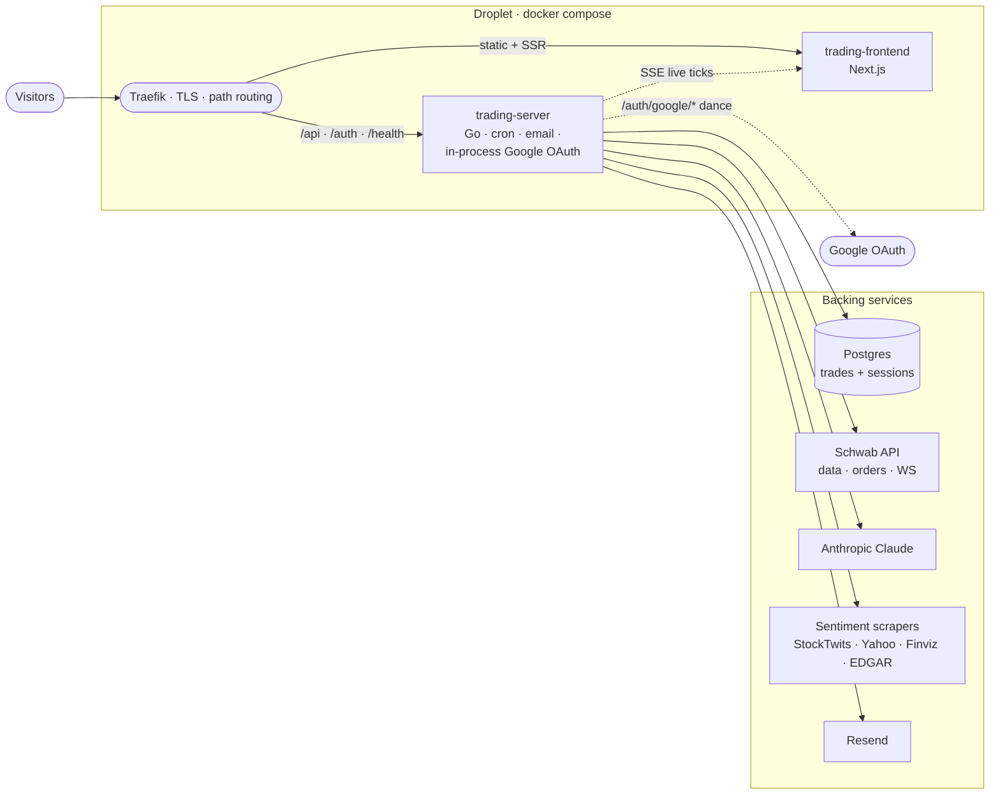

# vibetradez.com

AI-powered options trading service. A language model picks 3 ranked tickers + contract intent before the bell, then the same model decides each contract spec at the open and fires real orders into a Schwab brokerage account through a locked-down tool surface.

## Related repos

- [jaycebordelon.com](https://github.com/JayceBordelon/jaycebordelon.com) — personal portfolio and blog. Standalone deployable; planned to run on its own droplet.

Google OAuth is handled in-process by the trading-server binary at `/auth/google/start` + `/auth/google/callback`. The Google Cloud Console redirect URI is `https://vibetradez.com/auth/google/callback`.

## Architecture



Visitors hit Traefik, which routes by path: `/api`, `/auth`, `/admin`, `/health` go to the Go trading-server; everything else goes to the Next.js trading-frontend. The trading-server owns every outbound dependency: Postgres for picks / executions / summaries / users / sessions, Schwab for live quotes + WebSocket ticks + Trader API orders, Anthropic Claude for the morning picker and EOD analysis, four sentiment scrapers for the morning signal aggregation, and Resend for email. Sign-in is a direct Google OAuth flow handled in the trading-server binary; the session cookie is validated against a local sessions table on each `/api/*` request. The trading-frontend doesn't talk to anything outside the droplet directly; live option ticks flow back to it as SSE from the trading-server.

## What's here

```
vibetradez.com/
├── server/                 Go API (cron jobs, 9:25 picker + 9:30 at-open agent, Schwab market data, in-process Google OAuth, Resend email)
│   ├── cmd/scanner/        Main entry point, cron registration, daily lifecycle
│   ├── internal/
│   │   ├── auth/           In-process Google OAuth: store (users + sessions in dedicated Postgres pool), Google client, service, handlers
│   │   ├── calendar/       NYSE holiday + half-day calendar, market-hours math
│   │   ├── config/         Environment variable loading
│   │   ├── email/          Resend email client
│   │   ├── exec/           Broker entry points + reconcile + cancel-dangling + close + summary emails
│   │   ├── execagent/      9:30 at-open agent: conversation loop, tool schemas, hard caps
│   │   ├── quotes/         Live-quotes hub (Schwab WS to SSE fan-out)
│   │   ├── rollouts/       One-shot rollout email registry (v8_agent_executes)
│   │   ├── schwab/         Schwab OAuth + Market Data API + streaming client
│   │   ├── sentiment/      Market signal aggregator (4 sources)
│   │   ├── server/         HTTP API handlers (including SSE /api/quotes/stream)
│   │   ├── store/          PostgreSQL data layer (trades, executions, summaries, subscribers)
│   │   ├── templates/      HTML email templates
│   │   └── trades/         9:25 picker prompt + tool loop
│   ├── Dockerfile          Multi-stage Go build
│   └── go.mod
├── client/                 Next.js trading frontend (Next.js 16, shadcn/ui, Recharts v3)
│   ├── app/                App Router: /, /history, /terms, /faq, /trade/[symbol]
│   ├── components/         Dashboard, history, layout, subscribe, trade detail
│   ├── hooks/              Custom React hooks (live quotes via SSE, market status)
│   ├── lib/                API client, formatters, calculations
│   ├── types/              TypeScript interfaces
│   └── Dockerfile          Multi-stage Node.js build
├── local/                  Self-contained Docker stack with seeded Postgres for offline dev
├── docker-compose.yml      Self-contained stack (traefik + trading-server + trading-frontend) with own letsencrypt volume + bridge network
└── .github/workflows/      PR checks: lint + build + test on every PR
```

## Tech stack

| Component | Choice |
|---|---|
| Server | Go 1.25, PostgreSQL (DO managed), Anthropic Claude Opus 4.8, Schwab Market Data + Trader API, Resend email |
| Client | Next.js 16, React 19, Tailwind CSS v4, shadcn/ui (new-york), Recharts v3, TradingView Lightweight Charts |
| Auth | In-process Google OAuth (`golang.org/x/oauth2`); sessions in a dedicated Postgres pool |
| Live data | Schwab WebSocket Streamer API, fanned out to browsers via SSE |
| Infra | Docker Compose, Traefik v2.10 (in-repo), Let's Encrypt, Digital Ocean Droplet |

## Daily lifecycle

End-to-end flow of how a morning options pick goes from cron tick to filled position to subscriber inbox. Five crons own the day; the auto-execution basket is the only path that ever touches Schwab Trader.

```mermaid
flowchart TB
    classDef cron fill:#f5f3ff,stroke:#7c3aed,color:#0f172a
    classDef job fill:#eff6ff,stroke:#1d4ed8,color:#0f172a
    classDef agent fill:#fef2f2,stroke:#b91c1c,color:#0f172a
    classDef exec fill:#fffbeb,stroke:#92400e,color:#0f172a
    classDef email fill:#f0fdf4,stroke:#047857,color:#0f172a
    classDef store fill:#f1f5f9,stroke:#334155,color:#0f172a

    subgraph Cron["robfig/cron · America/New_York · skip on holidays & weekends"]
      C1["09:25 Mon-Fri<br/>CronScheduleOpen<br/>ticker selection only"]:::cron
      C1b["09:30:00 Mon-Fri<br/>CronScheduleExecute<br/>agent picks contracts + fires"]:::cron
      C1d["09:30 Mon-Fri<br/>quotes hub Start<br/>Schwab WS + SSE fan-out"]:::cron
      C2["* 9-15 Mon-Fri<br/>open-fill reconcile"]:::cron
      C1c["09:35 Mon-Fri<br/>CronScheduleCancelDangling<br/>cancel stale LIMITs +<br/>open-summary email"]:::cron
      C4["15:55 Mon-Fri<br/>CronScheduleClose +<br/>close-summary email"]:::cron
      C5["16:00 Mon-Fri<br/>CronScheduleEOD +<br/>EOD analysis email"]:::cron
      C6["16:30 Fri<br/>CronScheduleWeekly"]:::cron
    end

    OPEN["runTradeAnalysis<br/>cmd/scanner/main.go<br/>ticker selection only"]:::job
    EXECJOB["runExecuteAtOpen<br/>cmd/scanner/main.go<br/>dispatch at-open agent"]:::job
    PICKER["ClaudePicker.GetTopTrades<br/>tool loop: Schwab quotes,<br/>web_search, chain existence check.<br/>Output: 3 candidates (symbol + intent)"]:::agent
    DB[("Postgres<br/>trades · summaries ·<br/>subscribers · exec rows")]:::store

    AGENT["execagent.Agent.Run<br/>tool loop: live quotes,<br/>live chain, account funds,<br/>web search, place_options_order<br/>Output: per-candidate buy or skip+reason"]:::exec
    CANCEL["executor.CancelDanglingOpens<br/>+ SendExecutionSummary<br/>(single consolidated email)"]:::exec
    RECON["executor.ReconcileOpenOrders<br/>flip WORKING to FILLED in DB"]:::exec
    CLOSE["executor.CloseAllPositionsForDate +<br/>SendCloseSummary<br/>(single consolidated email)"]:::exec

    EOD["runEndOfDayAnalysis<br/>picker tool loop, EOD prompt"]:::agent
    WEEK["runWeeklyEmail<br/>aggregate Mon-Fri summaries"]:::job

    MORN_EMAIL["Resend morning email<br/>yesterday recap + 3 candidates +<br/>Open Dashboard CTA"]:::email
    OPEN_EMAIL["Resend execution summary<br/>(operator only, one per day:<br/>buys + skips with reasons)"]:::email
    CLOSE_EMAIL["Resend close summary<br/>(operator only, one per day)"]:::email
    EOD_EMAIL["Resend EOD email<br/>closing marks + per-trade notes"]:::email
    WEEK_EMAIL["Resend weekly email<br/>win rate, P&L, best/worst"]:::email

    C1 --> OPEN
    OPEN -->|"scrape 4 signal sources<br/>(StockTwits, Yahoo, Finviz, EDGAR)"| PICKER
    PICKER -->|"3 candidates (symbol +<br/>direction + intent +<br/>score + rationale)"| DB
    OPEN --> MORN_EMAIL

    C1b --> EXECJOB
    EXECJOB -->|"load saved candidates"| DB
    EXECJOB --> AGENT
    AGENT -->|"place_options_order tool:<br/>writes execution row +<br/>PlaceOrder (paper or live)"| DB
    AGENT -->|"skip: writes 'skipped'<br/>execution row + reason"| DB

    C2 --> RECON --> DB
    C1c --> CANCEL --> DB
    CANCEL --> OPEN_EMAIL
    C4 --> CLOSE --> DB
    CLOSE --> CLOSE_EMAIL

    C5 --> EOD
    EOD -->|"closing marks +<br/>per-trade notes"| DB
    EOD --> EOD_EMAIL

    C6 --> WEEK
    WEEK --> DB
    WEEK --> WEEK_EMAIL
```



Picker and at-open agent are decoupled, and so are *ticker selection* and *contract selection*. The 9:25 cron runs the picker against live Schwab equity quotes plus web search; option-chain prices are explicitly NOT consumed there because US options don't trade pre-market and Schwab's `/chains` endpoint serves yesterday's closing print until 9:30:00. Claude's output is exactly 3 candidates of `{symbol, direction, score, thesis, target_otm_pct, min_dte}`, saved to `trades` with the five contract-specific columns (strike, expiration, dte, estimated_price, stop_loss) left NULL. The morning email goes out at 9:25 with intent text ("~1.5% OTM, 3+ DTE") rather than fabricated strikes.

At 9:30:00 sharp, the at-open agent (`internal/execagent`) re-invokes Claude with the saved candidates plus a locked-down tool surface (live Schwab quotes, live option chain restricted to candidate symbols, account funds, web search, and a `place_options_order` tool). For each candidate the model reads the now-live chain, picks the strike + expiration + limit price, and either calls `place_options_order` (which writes the execution row + stamps the contract spec on the trade row + submits the BUY_TO_OPEN LIMIT in one shot) or declines with a written reason. Skipped candidates land in the database as `executions.status='skipped'` rows with the reason in `error_message`. The agent run is fire-and-forget; the per-minute reconcile cron flips fills throughout the morning. At 09:35 the cancel-dangling cron kills any still-WORKING LIMIT and sends ONE consolidated execution-summary email covering every candidate. The 15:55 cron sells every open position and sends ONE consolidated close-summary email.

## Auto-execution gating

If `TRADING_ENABLED=true`, the 9:30:00 ET cron dispatches the at-open agent against the 3 saved candidates. The model makes per-candidate decisions through tool calls; every hard cap is enforced at the tool layer (`internal/execagent/tools.go`), so a buggy prompt or jailbroken model cannot exceed them.

| Constant | Value | Why |
|---|---|---|
| `execagent.MaxOrdersPerRun` | 3 | One order per rank, mirrors candidate basket size |
| `execagent.MaxToolPremiumPerShare` | $10.00 | Per-share LIMIT cap, $1,000 of capital exposure per contract |
| `exec.MaxContractPremium` | $10.00 | Broker-facing twin of the tool cap; re-validated in `PlaceBuyToOpenAgent` |
| Symbol allowlist | the 3 morning candidates | The agent cannot order anything that wasn't in this morning's picker output |
| `LimitPriceMultiplier` | 1.10 | Documented anchor the agent prompt references when picking limit prices |

Worst-case daily blast radius is 3 × $1,000 = $3,000 capital exposure.

## Local development

```bash
cd local
docker compose -f docker-compose.local.yml up --build
# http://localhost:3001
```

The self-contained local stack boots Postgres + Go server + Next.js frontend + the auth service (mocked locally) with realistic seeded data. Stub keys are baked in so the server starts without making real Claude / Schwab / Resend calls; the cron jobs are pushed to Sunday so they never fire. Seed includes ~1 year of historical picks with EOD summaries.

For a server-only build:

```bash
cd server
go test ./...   # requires local Postgres at TEST_DATABASE_URL (defaults to dev string)
go build ./...
```

For client-only dev (against a remote server):

```bash
cd client
npm install
npm run dev
```

## Database

PostgreSQL hosted on Digital Ocean Managed Databases. Schema auto-migrates on server boot (CREATE TABLE IF NOT EXISTS for new tables, ALTER TABLE ... IF NOT EXISTS for additive columns). The full migration history lives inline in `server/internal/store/store.go`'s `migrate()` function.

## Environment variables

Required env vars are read from `server/.env` (loaded into the trading-server container via the docker-compose `env_file:` directive). Every required var causes the binary to `log.Fatal` on boot if missing, so a misconfigured container never serves traffic. See `server/.env.example` for the full list.

The client doesn't have its own env file in production; the `API_URL` env var is set in the compose file to point at the trading-server's internal hostname.

## Model version refresh policy

The picker model is configured via the `ANTHROPIC_MODEL` env var with the default defined as the `DefaultAnthropicModel` constant in `server/internal/config/config.go`.

Any time work touches the trade picker or this default, fetch the official Anthropic Go SDK documentation and refresh the default to the current latest production model. Anthropic publishes new model versions regularly; if the default sits stale, trade quality degrades silently. The page to read is:

- Anthropic Go SDK: <https://platform.claude.com/docs/en/api/sdks/go>

## Hostname routing

This service binds `Host(\`vibetradez.com\`)` plus the `www` subdomain via Traefik labels in `docker-compose.yml`. Route priority:

- `/api/*`, `/auth/*`, `/admin/*`, `/health` → trading-server (priority 20)
- everything else → trading-frontend (priority 10)

The Traefik container itself is not in this repo; it's expected to be running on the same Docker network (`app-network`, declared `external`) alongside these services.

## API protection

All `/api/*` routes on the trading server require the `X-VT-Source` header. Without it, requests return 403. The Next.js frontend includes this header on every fetch call via its server-side API proxy.

## CI / CD

`.github/workflows/pr-checks.yml` runs on every pull request:

1. Biome on the client
2. `next build` on the client
3. gofmt / `go vet` / `go build` / `go test -race` on the server (with an ephemeral Postgres service container)
4. actionlint on the workflow files

Production deploys are handled by the operator's deploy pipeline (separate from this repo).

## Trading service highlights

- **Two-Claude-call pipeline.** Pre-bell (9:25 ET) the picker returns exactly 3 ranked candidates with intent only: symbol, direction (CALL/PUT), score, thesis, `target_otm_pct`, `min_dte`. Specific strikes and prices are not chosen at 9:25 because US listed options don't trade pre-market. At market open (9:30:00 ET) the at-open agent re-invokes the same Claude model with the 3 candidates plus a locked-down tool surface (live Schwab quotes, live option chain restricted to candidate symbols, account funds, web search, and a `place_options_order` tool). For each candidate the agent decides whether to trade, picks the strike + expiration + limit price from the live chain, and either fires the order or records a skip with a written reason. Skipped candidates land in the dashboard with the explanation inline.
- **`/trade/[symbol]?date=...` deep-link page.** Reached by clicking any trade card on `/dashboard`, any row in the EOD table, or any contract row in the Daily Breakdown. Renders the full metric grid, Claudia's rationale, and the EOD result block.
- **Live data via Schwab WebSocket.** One outbound WS connection held during 9:30-16:00 ET, subscribed to LEVELONE_EQUITIES + LEVELONE_OPTIONS for today's picks, fanning ticks to all connected browsers over SSE at `/api/quotes/stream`. Each contract's row on the dashboard updates the instant Schwab pushes a new mark, not on a polled cadence.
- **Stock chart.** Underlying price candles from Schwab `GetPriceHistory` plus a modeled contract-premium overlay (sticky moneyness-based delta, anchored to the real entry/exit marks the cron persists). BUY/SELL render as full-height vertical lines + price-labeled dots at the candle level.
- **Auto-execution basket.** Single-pass agent. The picker returns exactly 3 ranked candidates; the at-open agent fires one contract per rank against the live Schwab chain. No greedy fill, no duplicate contracts, no daily basket budget — three candidates, up to three contracts, gated by a $10/share per-contract safety cap.
- **One execution-summary email + one close-summary email per day.** No per-trade receipts. The 9:35 ET cron emits the execution-summary (every candidate's outcome: buys with fill prices, skips with reasons). The 15:55 ET cron emits the close-summary (every position closed, realized P&L per row, total realized P&L for the day). Action-required callout fires when at least one row failed.
- **Email delivery via Resend.** Subscribers stored in Postgres; HTML templates in `server/internal/templates/`. Render the morning email locally via `go run ./cmd/preview-email`.
- **Granular `/health`.** One endpoint reports per-service status (database, anthropic, schwab_market_data, schwab_trading, market_signals, morning_picks, api) using actual SDK clients with latencies.

## Where the load-bearing logic lives

| Concern | Path |
|---|---|
| Picker (9:25) + execute-at-open (9:30) + cancel-dangling/summary (9:35) + close (15:55) + close-summary + EOD (16:00) + weekly (16:30 Fri) cron registration | `server/cmd/scanner/main.go` |
| Market open / holiday / half-day gating | `server/internal/calendar/calendar.go` |
| Signal scraping (4 sources) | `server/internal/sentiment/scraper.go` |
| 9:25 picker tool loop + Anthropic SDK wiring | `server/internal/trades/picker.go` |
| Picker prompts (`AnalysisPrompt`, `EndOfDayPrompt`) | `server/internal/trades/prompt.go` |
| 9:30 at-open agent (conversation loop, final-JSON reconciliation) | `server/internal/execagent/agent.go` |
| Agent tool schemas + validation + hard caps | `server/internal/execagent/tools.go` |
| Agent system prompt | `server/internal/execagent/prompt.go` |
| Broker entry points (`PlaceBuyToOpenAgent`, `InsertSkippedExecutionAgent`, `AvailableFundsAgent`) + reconcile + cancel-dangling + close-all + summary emails | `server/internal/exec/service.go` |
| Email templates (morning, execution-summary, close-summary, EOD, weekly, error) | `server/internal/templates/` |
| Rollout v8 announcement (agent execution) | `server/internal/rollouts/v8_agent_executes.go` + `server/internal/templates/rollout_agent_executes.html` |
| In-process Google OAuth (`/auth/google/start`, `/auth/google/callback`, AttachUser middleware) | `server/internal/auth/` |

## Common operations

### Re-authorize Schwab OAuth

Visit `https://vibetradez.com/auth/schwab` in a browser. Tokens are stored in the `oauth_tokens` table and auto-refresh.

### Check server health

```bash
curl https://vibetradez.com/health | jq
```

Returns per-service status for database, Anthropic, Schwab, market_signals, and api with latencies. The Anthropic check goes through the official SDK and warns (instead of fails) when a stub local key is detected.

### Docker commands on production

```bash
ssh jayce@<server>
cd <project-path>
docker compose logs trading-server --tail 50    # View Go server logs
docker compose logs trading-frontend --tail 50  # View Next.js logs
docker compose restart trading-server           # Restart Go server
docker compose up -d --force-recreate trading-server  # Full recreate
```
