# VibeTradez UX/UI Audit: 2026-06-09 (second run)

Post-change capture set for the dashboard P&L decomposition, the executions
tape, and the new per-trade detail charts. Second audit of the day, hence
the `-2` folder: the morning's audit (the light-theme token pass) is
preserved at [2026-06-09](../2026-06-09/audit.md) per the dated-folder
convention. The route set grew by two: the holding and closed-trade detail
views are now captured (44 shots, 11 routes × 2 viewports × 2 themes), and
`run.sh` now prunes stale JPEGs from its output folder on every run so a
removed route can never linger in a committed audit.

| | |
|---|---|
| **Captured** | 2026-06-09 (afternoon) |
| **Branch** | `dashboard-three-series-executions` |
| **Stack** | `local/docker-compose.local.yml` + override (frontend `:3005`), seeded via `generate-seed.py` |
| **Tool** | `scripts/ui-audit` (Playwright / headless Chromium) |
| **Viewports** | Desktop 1440×900 (full-page) · Mobile 390×844 (full-page) |
| **Themes** | Light · Dark |
| **Pages** | Landing, Dashboard, Holdings, Holding detail, Closed, Closed trade detail, Transcripts index, Session transcript, FAQ, Terms, Privacy |

## What changed in this PR

1. **The dashboard chart is now a dollar P&L decomposition.** Three series
   on one axis: realized (booked round trips, cumulative inside the
   window, mint with a zero-anchored wash), unrealized (the open book's
   EOD mark, clay), and SPY buy-and-hold P&L on the same starting equity
   (dashed muted ghost). The headline strip doubles as the legend: each
   stat carries a color key matching its stroke (the SPY key is dashed),
   with percent-of-starting-equity subs and the Beating/Trailing pill now
   in dollars. A zero reference line anchors the signed values. Server
   side, the equity-curve endpoint decorates each point with
   `realized_cum` (from the decision log's round trips) and `unrealized`
   (from the daily book snapshots), unit-tested including window
   exclusion and non-curve-day close handling.
2. **Today's executions tape.** Every move the model commits today renders
   as a flowing hairline-divided ledger between the chart and the session
   link: a 2px action-colored tick on each row's left edge (the
   transcript's border language), small-caps mono action ink, the symbol,
   option contract shorthand, a one-line rationale, and a right-aligned
   mono cluster (qty × limit, notional) with quiet status marks: FILLED
   as a small green check, WORKING as a pulsing amber dot, CANCELED
   struck muted. Money moves lead; holds settle to the bottom as the
   quiet coda. The section subtitle carries the headline ("8 moves ·
   $684 deployed · 3 held").
3. **Per-trade charts on the detail pages.** Every holding and closed
   trade now charts its life: equities show the stock's value over the
   holding period (market closes when available, the snapshot-implied
   per-share value otherwise, with a dashed entry-price reference);
   options show the per-contract value from the daily book snapshots
   (clay, right axis) against the underlying's closes (muted, left axis)
   with a dashed strike reference. Axis dollars adapt precision to
   magnitude so an option premium's $4 to $5 range doesn't collapse into
   identical ticks. Short holds render visible dots so a few points read
   as data; long holds thin their ticks. Either series degrades
   gracefully with honest copy when its source has nothing.
4. **Supporting plumbing.** Two new endpoints
   (`/api/portfolio/position-history`, `/api/price-history`) with
   contract tests; the seed now backfills per-day position snapshots
   across every holding's and every closed trade's window (close date
   exclusive, mirroring the EOD cron's real timing) so all the new
   charts render against seeded data; vestigial `HistorySkeleton` and the
   orphaned `--tier-pill-top10` tokens removed.

## Findings

- [bug, fixed in this PR] The first capture pass exposed a window bleed
  the stats made obvious: a 20-day AVGO round trip charted eleven weeks of
  history. Position history is keyed by symbol, and a ticker the model has
  traded more than once carries every round trip's snapshots, so the chart
  absorbed unrelated trips. Both series are now clamped to the trade's own
  open/close window client-side, where the dates live.
- [polish, fixed in this PR] The same pass caught the detail chart's value
  axis collapsing to repeated "$5" ticks on the option premium range; the
  axis formatter now adapts decimal precision to magnitude.
- [polish, fixed in this PR] The closed-trade empty state wrongly read "a
  position opened today" for a 20-day-old trade when no series existed;
  closed trades now get their own honest copy. (With the seed backfill the
  state should no longer occur locally at all.)
- [note] The underlying's market-close line cannot render against the
  local stack (stub Schwab keys), so detail-chart captures show the
  snapshot-derived series with the "close unavailable right now" caption.
  In production the line fills in. This is the designed degradation, not
  a defect.
- No overflow, clipping, theme breaks, or responsive failures observed on
  any of the 44 captures; the morning audit's token-level fixes carry
  through unchanged on the untouched pages.

---

## Dashboard — `/dashboard`

| Desktop · Light | Desktop · Dark |
|---|---|
| 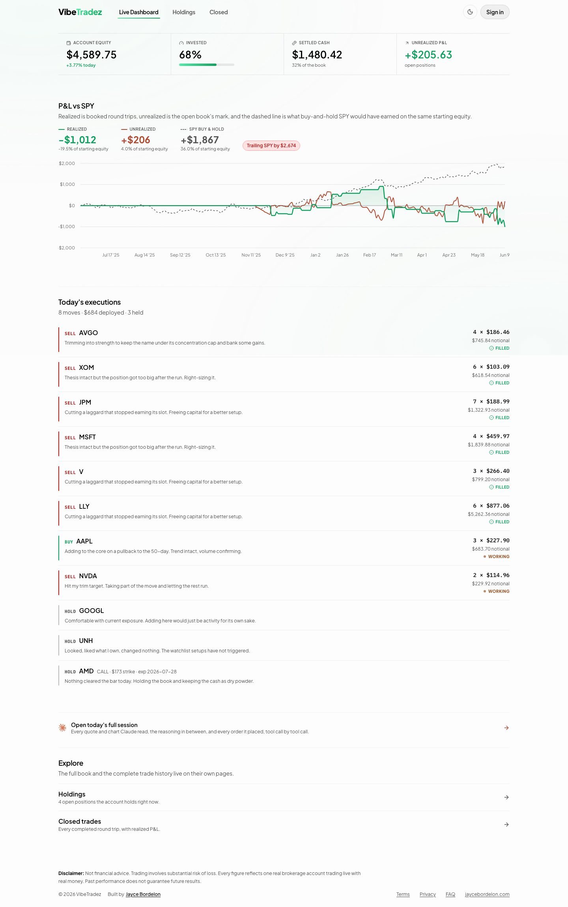 | 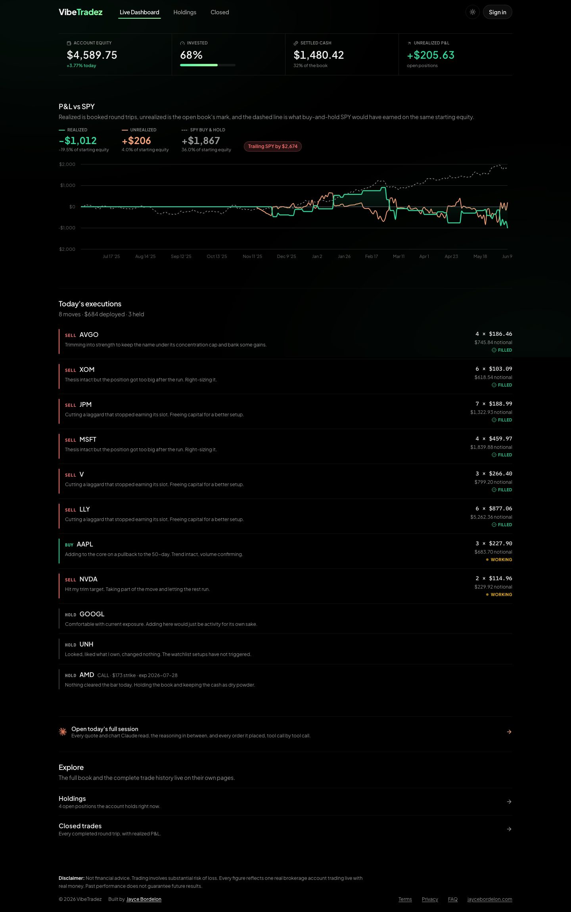 |

| Mobile · Light | Mobile · Dark |
|---|---|
| 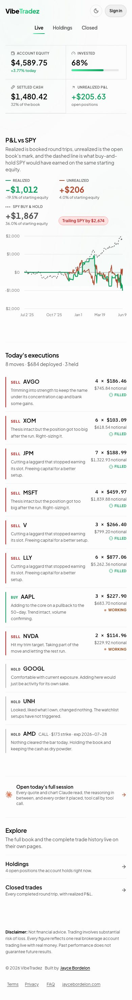 | 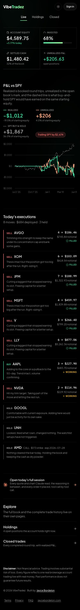 |

**User perspective.** The page now answers the three questions in order:
how is the account doing (stat strip), where did the P&L come from and how
does it compare to doing nothing (the decomposition chart, whose header
stats are the legend), and what did the model do about it today (the
tape). The seeded day reads clearly: a string of filled trims in red, one
working buy and one working trim in amber, and three quiet holds, with
realized at -$1,012 against SPY's +$1,867 telling the honest
underperformance story the pill summarizes in dollars.

---

## Holding detail — `/holdings?trade=<id>`

| Desktop · Light | Desktop · Dark |
|---|---|
| 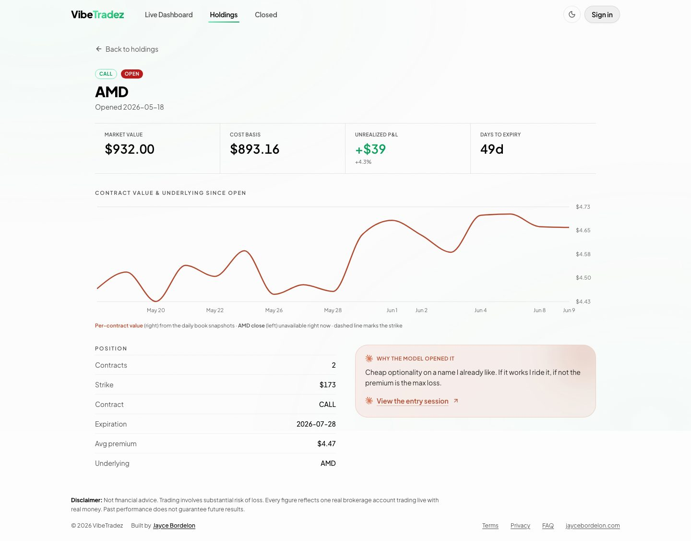 | 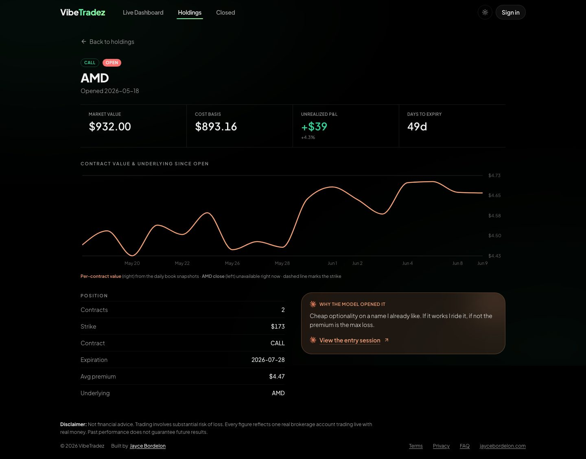 |

| Mobile · Light | Mobile · Dark |
|---|---|
| 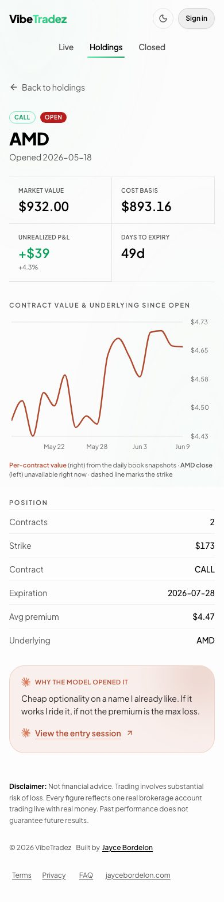 | 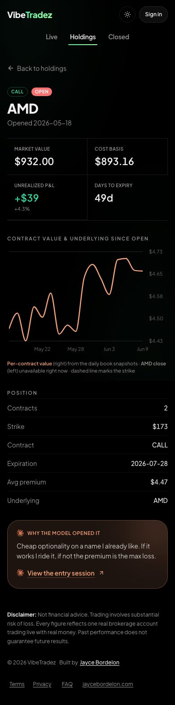 |

**User perspective.** The captured trade is the seeded AMD call: the
per-contract value line walks from the entry premium to the current mark
across the holding weeks, the caption explains both sources and the strike
reference, and the stat strip, contract facts, and clay rationale card sit
unchanged below. The chart slots between the stats and the facts without
boxing anything in.

---

## Closed trade detail — `/closed?trade=<id>`

| Desktop · Light | Desktop · Dark |
|---|---|
| 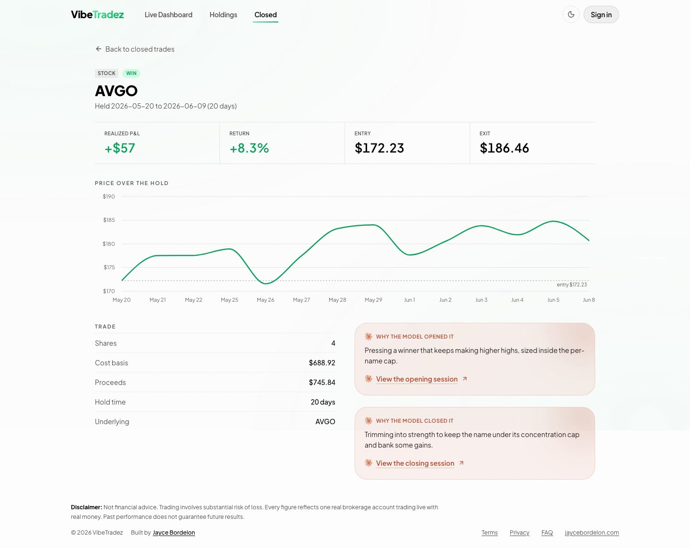 | 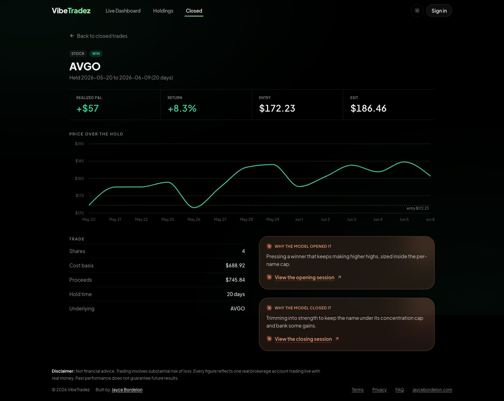 |

| Mobile · Light | Mobile · Dark |
|---|---|
| 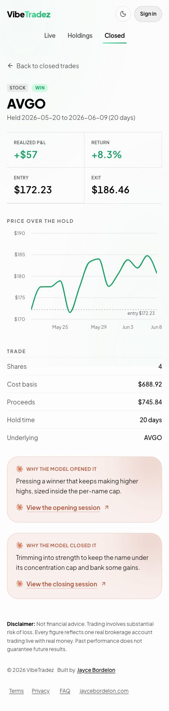 | 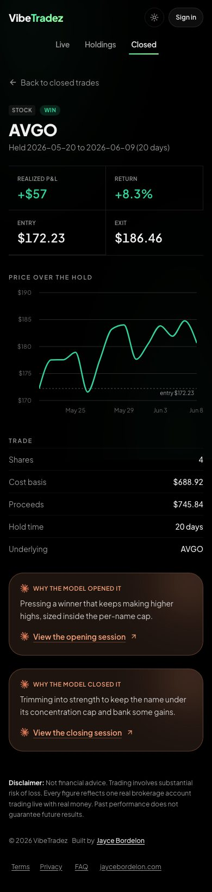 |

**User perspective.** A finished round trip charts its whole hold from
entry cost toward exit proceeds (close date exclusive, since the EOD
snapshot never sees the sold position), so a win visibly climbs into its
exit and a loss visibly bleeds. Entry and exit remain in the stat strip,
and the open/close rationales with their session links carry the story.

---

## Everything else

Holdings, Closed, Landing, Transcript, FAQ, Terms, and Privacy are
unchanged by this PR; their captures are included for the complete set and
match the morning audit's post-fix state.

| | Desktop · Light | Desktop · Dark | Mobile · Light | Mobile · Dark |
|---|---|---|---|---|
| Landing | 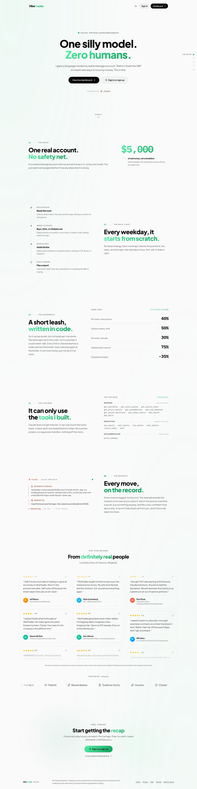 | 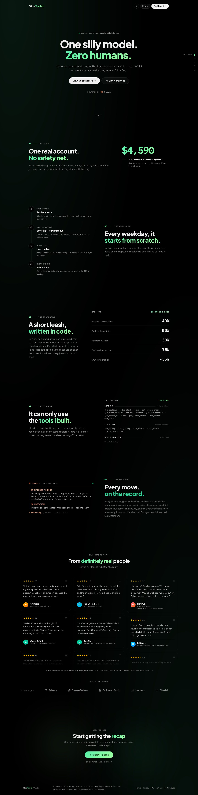 |  |  |
| Holdings |  |  |  |  |
| Closed | 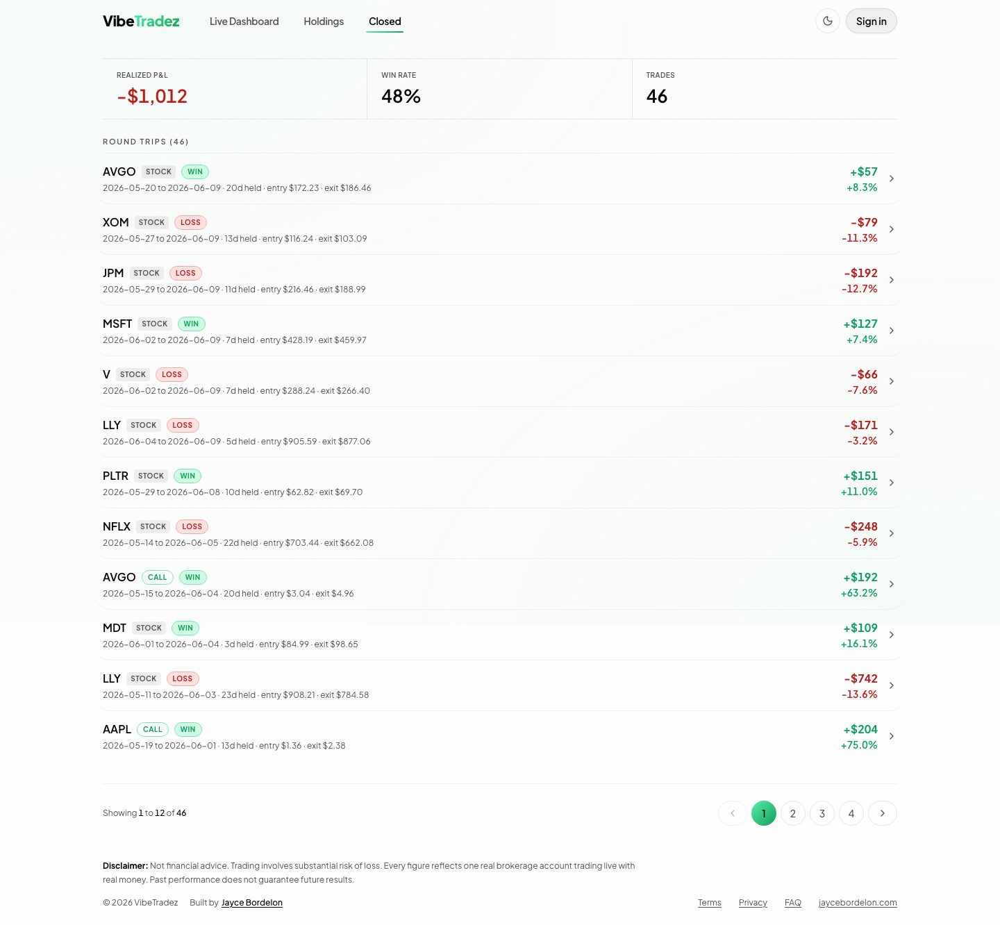 | 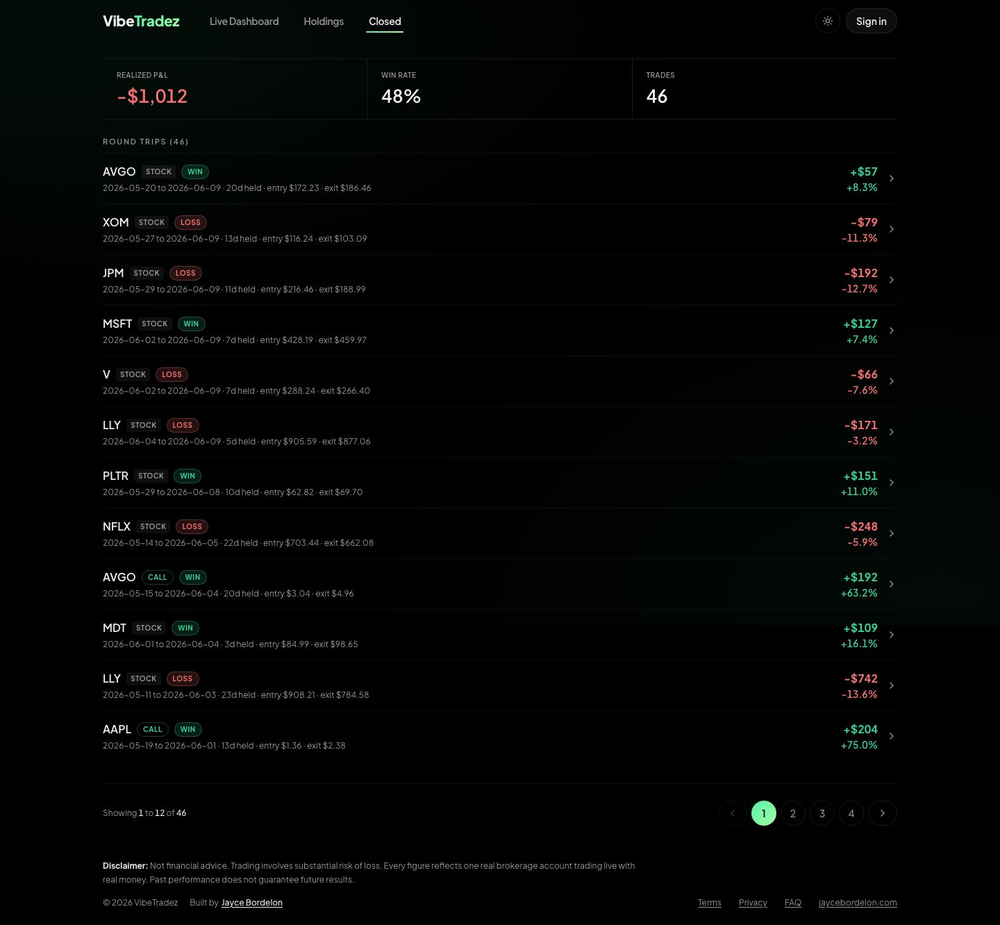 |  |  |
| Transcript |  | 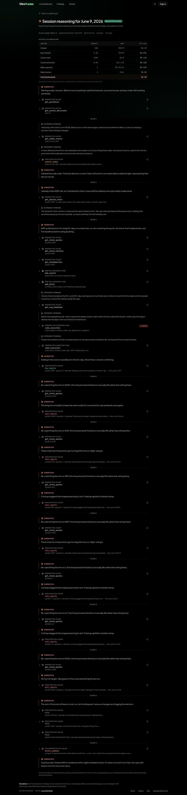 | 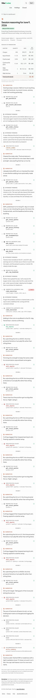 | 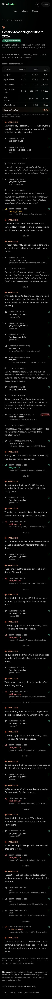 |
| Transcripts index | 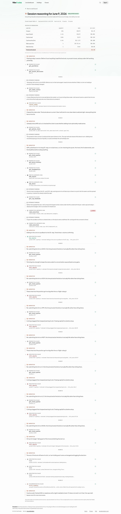 |  |  |  |
| FAQ |  |  |  |  |
| Terms |  |  |  | 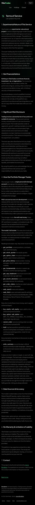 |
| Privacy |  | 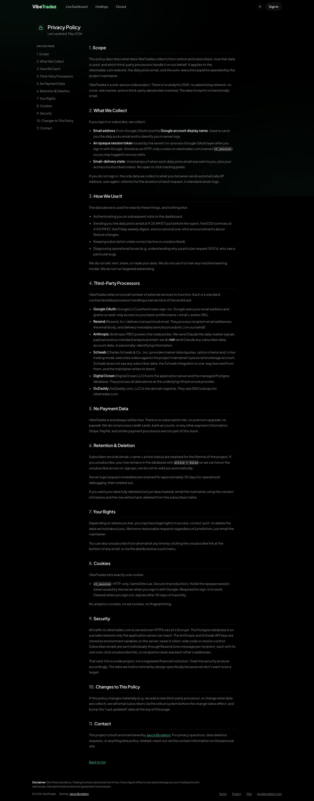 |  | 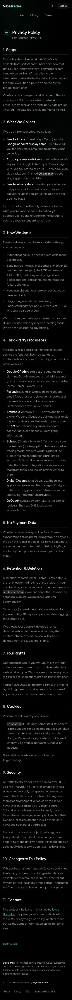 |
