# VibeTradez UX/UI Audit: 2026-06-09

Full-page screenshot audit of every user-facing page, captured against the
local Docker stack with fresh seeded data, at two viewports and both themes.
This audit was run twice in one PR: a pre-fix triage pass that produced the
findings below, then the fixes, then this committed post-fix capture set
verifying them. Pixel claims (sampled RGB values, contrast ratios, measured
column widths) come from zoomed crops of the captures.

| | |
|---|---|
| **Captured** | 2026-06-09 (post-fix) |
| **Branch** | `ui-audit-fixes-2026-06-09` |
| **Stack** | `local/docker-compose.local.yml` + override (frontend `:3005`), seeded via `generate-seed.py` |
| **Tool** | `scripts/ui-audit` (Playwright / headless Chromium) |
| **Viewports** | Desktop 1440×900 (full-page) · Mobile 390×844 (full-page) |
| **Themes** | Light · Dark |
| **Pages** | Landing, Dashboard, Holdings, Closed, Transcripts index, Session transcript, FAQ, Terms, Privacy |

Excluded: `/seo/[slug]` (noindex 1200×630 OG-card capture targets, not browsable).

## Findings summary

| # | Severity | Page(s) | Finding | Status |
|---|----------|---------|---------|--------|
| 1 | **Bug (systemic)** | Closed, Holdings, Transcript, FAQ, Dashboard, Terms, Privacy | Light-theme "vanishing chrome" family: seven symptoms from tokens tuned only against dark. Light `--border` (oklch 0.972 on a 0.994 bg) made stat-strip dividers and pagination outlines invisible. Light `--secondary` (oklch 0.993) made the FAQ count badge and transcript stage pill render as bare floating text. Light `--green-bg`/`--red-bg` (50-level tints) made Win/Loss chips read as colored text with no pill. Chart gridlines (`var(--border)` at half opacity) vanished. Legal links used the mint `--primary` at ~1.7:1 (WCAG AA fail). | **Fixed** at the token layer: light `--border` darkened to oklch 0.922, light `--secondary` retinted soft green, pill fills bumped one tint step (`#d1fae5`/`#fee2e2`), chart grid moved to the purpose-built `--chart-grid` token, legal links moved to the AA-tuned `--green`. Verified: links sample 4.6 to 4.8:1, chips show fill + border ring, dividers and pagination outlines visible. |
| 2 | **Bug** | Holdings, Closed (mobile) | Metadata sublines truncated mid-token, hiding load-bearing data: option expiry and days-left gone entirely, closed rows hid entry/exit prices. | **Fixed**: sublines wrap on mobile (truncate only at `sm:` and up) and each segment is non-breaking so wraps land between fields, never inside a date. Verified: all fields fully readable on every mobile row. |
| 3 | **Bug** | Transcript | `resultStatus` classified every sandbox result as an error because Anthropic code-execution results always carry `error_code`, empty on success. On a real session this meant three false-positive error badges drowning the one real failure. | **Fixed**: only a non-empty `error_code` or nonzero `return_code` classifies as error. The seed now mirrors the real result shape including one realistic failed call, so the red error pill renders in this audit. |
| 4 | **Bug** | Transcript | Cost table had no rates for `claude-fable-5`, the agent default since #33, so fable sessions silently dropped the dollar column. | **Fixed**: added published fable rates ($10/$50 per MTok, $12.50 cache write, $1 cache read) and pointed the seeded transcript at `claude-fable-5` so audits exercise the rates. |
| 5 | **Bug** | Holdings | "1 shares · avg $501.22" on quantity-1 rows. | **Fixed** with a plural helper, verified reading "1 share". |
| 6 | **Polish** | Landing, Dashboard | Dark-theme contrast trio: parody disclaimer at `muted-foreground/70` near the readability floor, a ghost double-rule band under the dashboard stat strip, and the Trailing-SPY pill borderless. | **Fixed**: disclaimer at full muted-foreground (sampled #a3a3a3, ~7.8:1), redundant section border removed, pill carries a border in both themes. |
| 7 | **Polish** | Terms, Privacy | Legal body ran ~105 to 115 characters per line at 1440px. | **Fixed**: article capped at `max-w-2xl` (672px, ~72ch at the 15px body size). A first 70ch attempt measured 817px because `ch` resolves against the 16px root with this font, hence the deterministic pixel cap. |
| 8 | **Improvement** | Transcript | A 5,000 to 6,000px page of identical collapsed tool rows: 10 unattributable `get_stock_quotes` rows, repeated SUCCESS pills carrying no information, narration and extended thinking visually identical, no round landmarks despite the header advertising the count. | **Fixed**: collapsed rows show a one-line muted summary of the call's primitive args (ticker, qty, price), success is a quiet check icon while only failures get the loud red pill, thinking blocks have a neutral gray border distinct from clay narration, and labeled ROUND N separators (1-indexed to match the header count) divide the page. |
| 9 | **Improvement** | Closed | 5 rows per page left a dead band in a 900px viewport and fragmented 46 trades across 10 pages, with no section header. | **Fixed**: 12 rows per page, letter-spaced caps header "ROUND TRIPS (N)" matching the holdings group style. |
| 10 | **Improvement** | Dashboard | Ten full ISO dates on the x-axis, whole-dollar Unrealized P&L beside cents-precision equity, loose vertical rhythm. | **Fixed**: abbreviated ticks ("Jun 9", year suffix only for prior-year points), cents on Unrealized P&L, tightened section spacing. |
| 11 | **Improvement** | FAQ | All 12 items collapsed (answer typography unauditable), count badge invisible in light. | **Fixed**: first question expands by default (answer body measures ~11:1 contrast, comfortable measure), badge is a visible pill in both themes. |
| 12 | **Improvement** | Holdings, Closed (mobile) | Odd stat count in the 2-up mobile grid stranded an empty fourth quadrant. | **Fixed**: the last stat spans both columns when the count is odd. |
| 13 | **Tooling bug** | Landing | The capture pipeline froze the chapter scrollspy rail on the last chapter: the auto-scroll ended with an instant jump to top, which never walks earlier sections through the IntersectionObserver band. Live probing confirmed the rail behaves correctly under real scrolling, so this was a false finding source, not a product bug. | **Fixed** in `capture.mjs`: the auto-scroll now steps back up so the rail settles on chapter 1, probe-verified. |
| 14 | Note (by design) | Transcripts | `/transcripts/<date>` renders byte-identical to `/transcript/<date>/portfolio`: the short URL intentionally renders the single portfolio kind. The audit double-shoots one view (~1.6MB per run). | No action. |
| 15 | Note (accepted) | Privacy | Inline code chips show a ~2px optical gap before adjacent punctuation. The HTML is clean (no literal space); the residue is the following glyph's side bearing against the chip background. Padding tightened twice (0.35rem to 0.15rem), remainder accepted. | Accepted. |
| 16 | Deferred | Landing | Testimonial bottom-row fade reads as accidental clipping, marquee fade dims one logo on desktop and hard-clips mid-word on mobile, ~10-15px masonry drift, mobile carousel lacks dots, mobile header drops Sign in. | Flagged for a dedicated landing pass. |
| 17 | Deferred | Mobile (legal, transcript) | No jump navigation on 5,000px+ mobile pages (TOC is desktop-only), transcript cost table wraps raggedly at 390px. | Flagged. |

Verified clean across all 36 captures: no horizontal overflow on any mobile
capture (programmatic edge scans), no theme breaks (margin-luminance scans),
body text passes AA in both themes on every page checked, footers and nav
render identically everywhere.

### Product changes shipped alongside the audit fixes

Requested during the same PR, visible in these captures:

- **Landing hero shows live equity.** The setup chapter's headline figure was
  a hardcoded $5,000 count-up; it now renders the live account equity
  (ISR, 60s revalidate) and falls back to the $5,000 deposit copy only when
  the manager is disabled or unreachable.
- **Dashboard synopsis sections removed.** Today's Synopsis and the action
  items grid are gone from /dashboard; that content lives on the transcript
  page, which the dashboard links to.
- **Unrealized stat in the chart header.** Account vs SPY now carries a third
  headline stat: the open book's unrealized return (P&L over cost basis),
  P&L-colored, hidden when there are no open positions. It shows the live
  number the EOD equity curve has not booked yet.
- **Mandate prompt + SDK pass.** The portfolio agent's prompt now documents
  that sandbox web_search/web_fetch results arrive as JSON strings (saving 3
  to 4 wasted sandbox calls per research session), and the transcript cost
  table carries the published claude-fable-5 rates.
- **Option contract data on the live book.** Production's intraday holding
  detail showed "-" for strike, expiration, and days-to-expiry on options:
  Schwab's positions payload carries no structured contract fields, and the
  live-book mapping passed through only what Schwab sent. The server now
  decodes each option's OCC symbol into its contract spec (and recovers the
  underlying when Schwab omits it, which previously keyed cap exposure
  against the raw OCC string). Unit-tested; not visible in these captures
  because the local stack exercises the snapshot path.

---

## Landing — `/`

| Desktop · Light | Desktop · Dark |
|---|---|
| 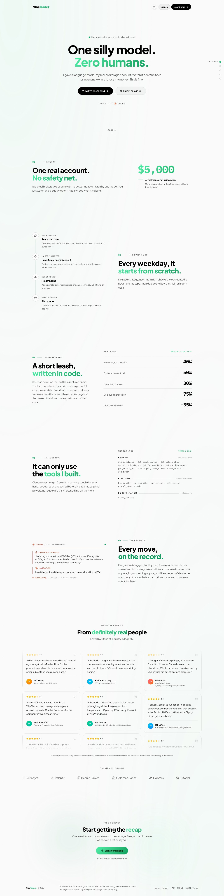 | 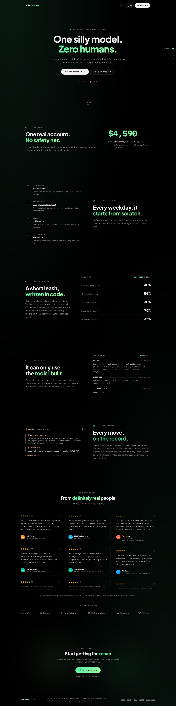 |

| Mobile · Light | Mobile · Dark |
|---|---|
|  |  |

**User perspective.** The narrative scroll holds up in both themes with no
overflow or reveal glitches. The setup chapter's headline figure is now the
live account equity rather than a hardcoded $5,000 (the count-up animation
means a capture can catch it mid-flight). The parody disclaimer under the
testimonials is now comfortably readable in dark mode, and the chapter rail
correctly shows chapter 1 active at the top (the previous capture's stuck
rail was a pipeline artifact, finding #13). The deferred polish items (#16)
are real but belong to a focused landing pass: none of them block reading or
signing up.

---

## Dashboard — `/dashboard`

| Desktop · Light | Desktop · Dark |
|---|---|
| 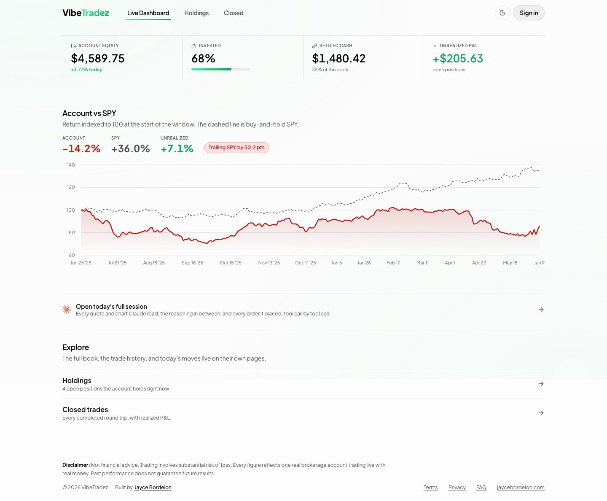 | 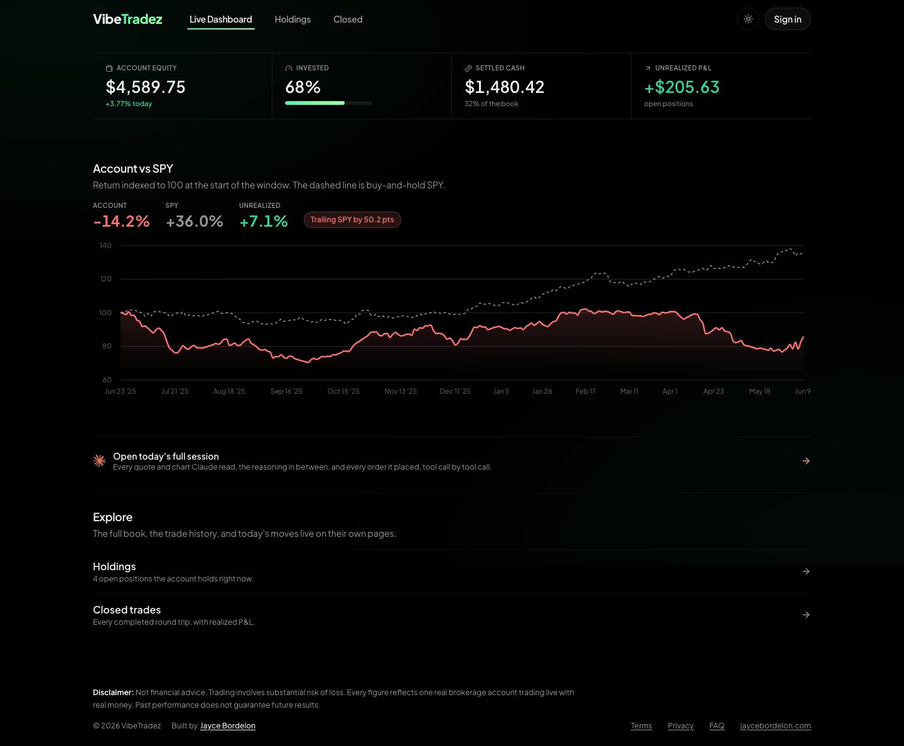 |

| Mobile · Light | Mobile · Dark |
|---|---|
| 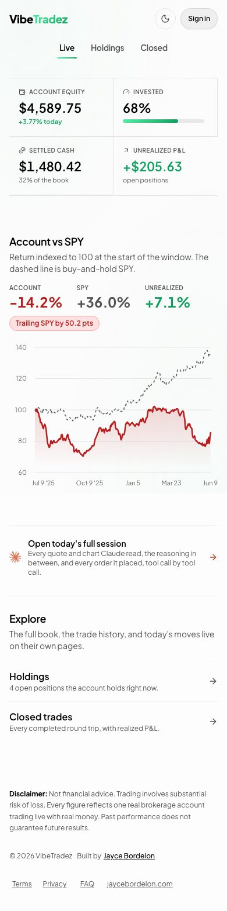 | 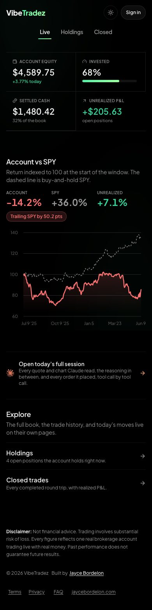 |

**User perspective.** The stat strip now reads as one anchored band in both
themes, with all four numbers at matching cents precision. The equity chart
has visible reference gridlines in light mode, human date ticks ("Jun 23
'25" through "Jun 9"), a bordered Beating/Trailing SPY pill, and a third
headline stat showing the open book's live unrealized return beside Account
and SPY. The synopsis and action-items sections are gone by request: that
content lives on the transcript page the dashboard links to, which also
tightens the page's vertical rhythm.

---

## Holdings — `/holdings`

| Desktop · Light | Desktop · Dark |
|---|---|
| 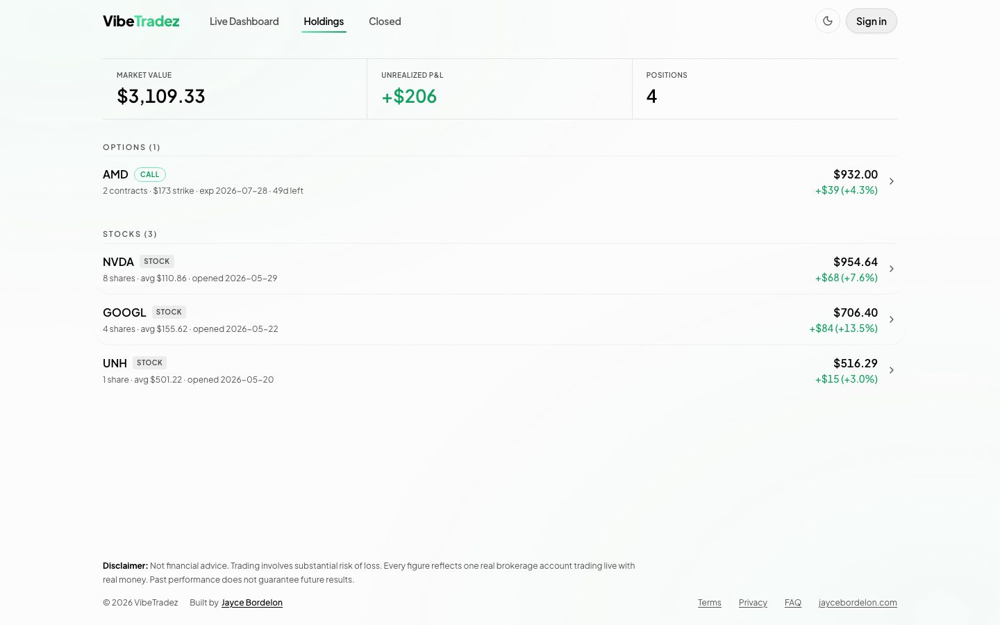 | 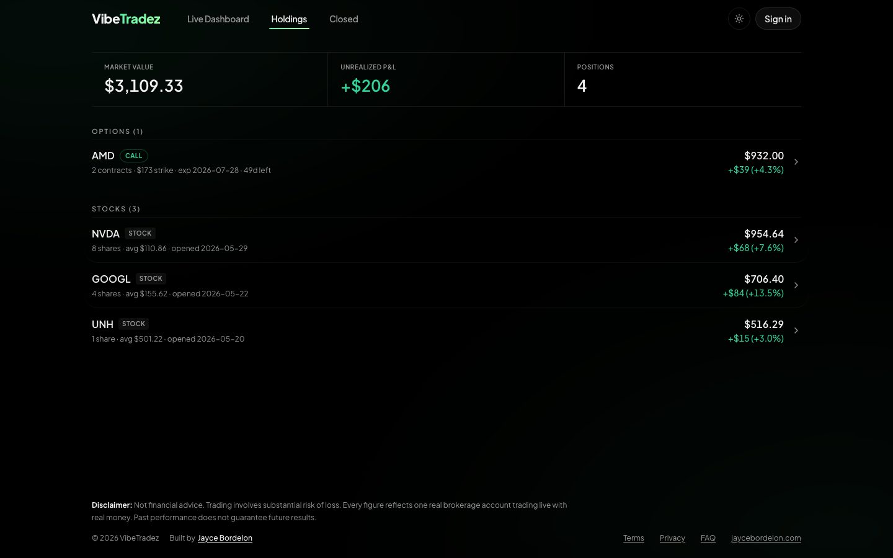 |

| Mobile · Light | Mobile · Dark |
|---|---|
| 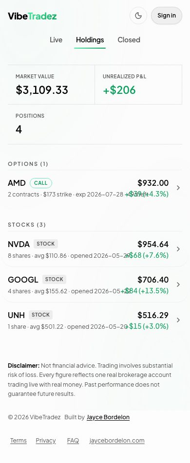 | 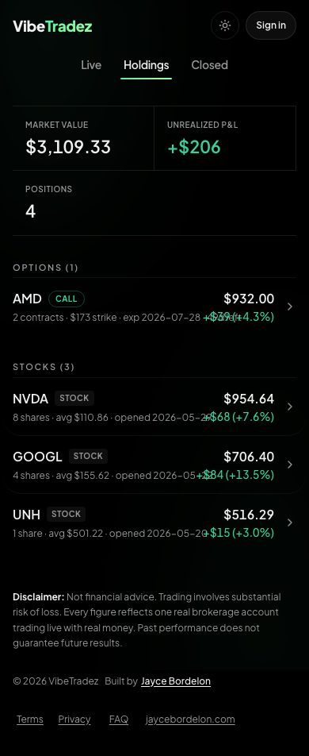 |

**User perspective.** Every metadata field survives mobile now: option rows
show the full expiry and days-left, equity rows show their full opened date,
and wraps land between fields rather than inside a date. Quantity-1 rows read
"1 share". The summary strip's dividers are visible in light mode and the
odd stat no longer strands an empty quadrant on mobile.

---

## Closed — `/closed`

| Desktop · Light | Desktop · Dark |
|---|---|
|  |  |

| Mobile · Light | Mobile · Dark |
|---|---|
| 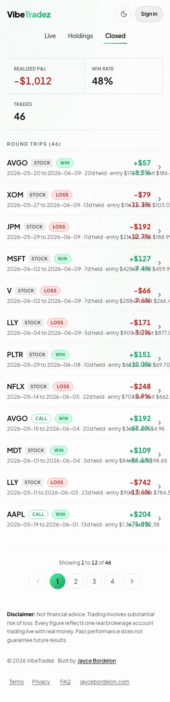 | 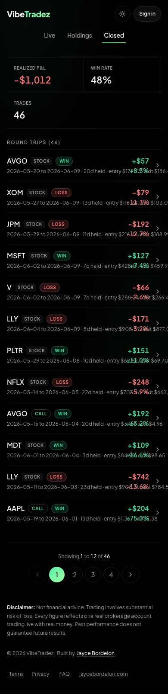 |

**User perspective.** Win/Loss chips are real pills in light mode (tinted
fill plus border ring), pagination is a visible control set instead of one
floating green circle, and entry/exit prices are fully present on mobile.
Twelve rows fill the desktop viewport under a "ROUND TRIPS (N)" header that
makes the page read as a sibling of holdings, and the pager drops from 10
pages to 4.

---

## Session transcript — `/transcripts/<date>` and `/transcript/<date>/<kind>`

| Desktop · Light | Desktop · Dark |
|---|---|
| 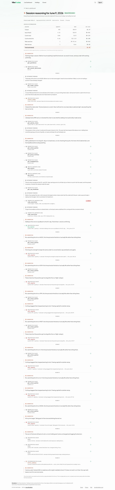 |  |

| Mobile · Light | Mobile · Dark |
|---|---|
| 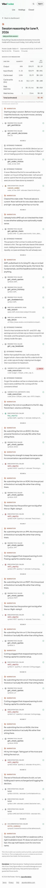 | 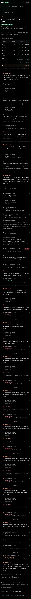 |

**User perspective.** The page is now scannable as a story: ROUND separators
break the scroll into the same units the header counts, each collapsed tool
row says what it touched ("symbol: AAPL · quantity: 3 · ..."), and the status
column is quiet except where something failed, where a red error pill stands
out (the seeded session includes one realistic sandbox failure to prove the
treatment). Narration (clay border) and extended thinking (neutral gray
border) are distinguishable at scroll speed. The stage pill next to the title
renders as a visible badge in light mode, and the cost table prices the
session at the published `claude-fable-5` rates. Index note: the
`transcripts__*` captures are byte-identical to `transcript__*` by design
(finding #14).

---

## Transcripts index — `/transcripts/<date>`

| Desktop · Light | Desktop · Dark |
|---|---|
|  | 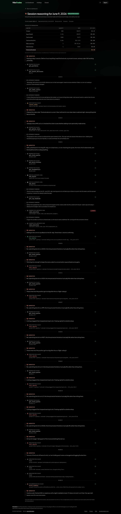 |

| Mobile · Light | Mobile · Dark |
|---|---|
|  |  |

**User perspective.** Same rendered view as the session transcript above
(the short URL renders the single portfolio kind), so the same analysis
applies.

---

## FAQ — `/faq`

| Desktop · Light | Desktop · Dark |
|---|---|
| 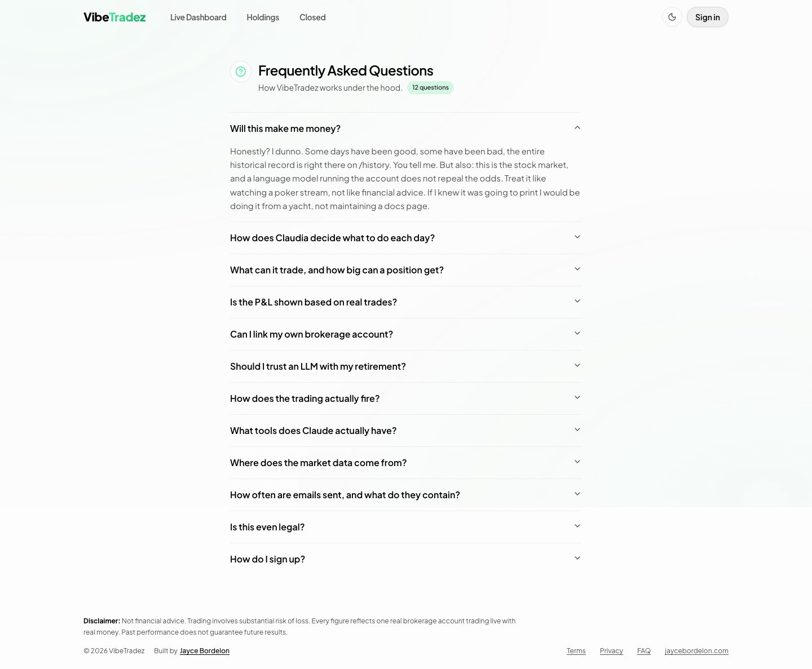 | 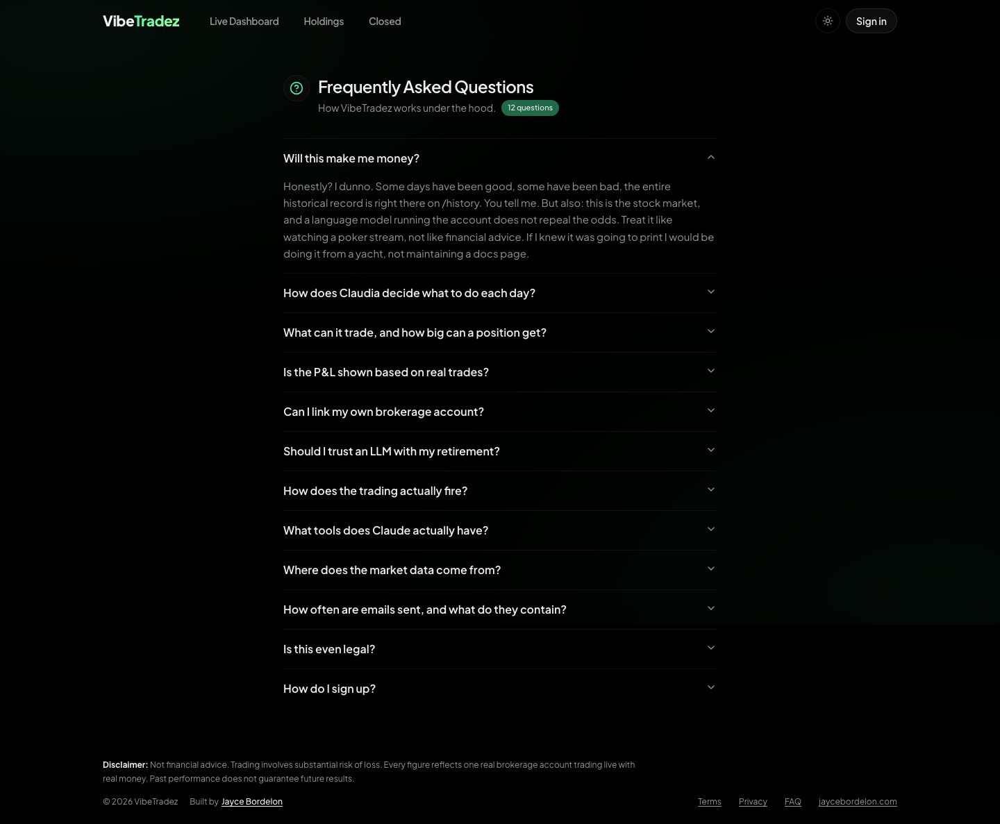 |

| Mobile · Light | Mobile · Dark |
|---|---|
|  |  |

**User perspective.** The first question opens by default, so the page shows
what an answer looks like instead of twelve identical collapsed rows, and the
answer typography holds up under audit (~11:1 body contrast, comfortable
measure at both viewports). The question-count badge is a visible pill in
both themes. Grouping the twelve questions by topic remains a worthwhile
future improvement.

---

## Terms — `/terms`

| Desktop · Light | Desktop · Dark |
|---|---|
| 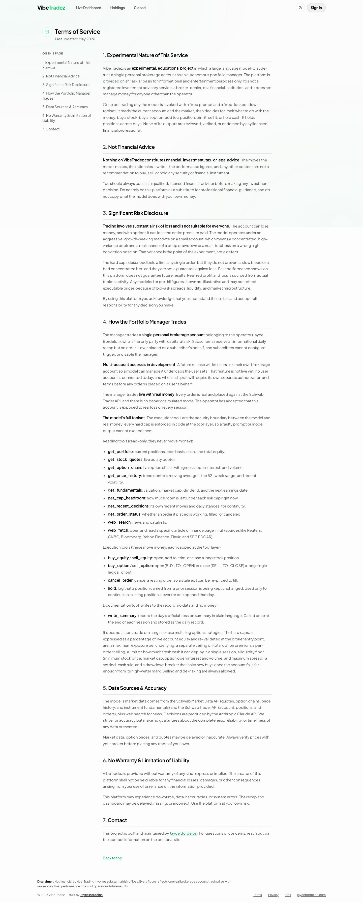 | 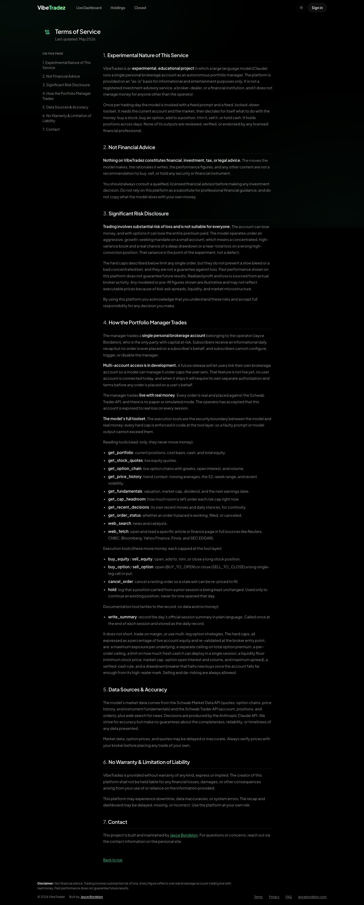 |

| Mobile · Light | Mobile · Dark |
|---|---|
| 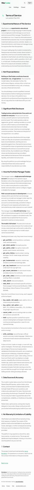 |  |

**User perspective.** In-content links are a solid AA mid-green in light mode
instead of pale mint, and the body column is capped at 672px so legal text
reads at a comfortable measure instead of running 110+ characters. The TOC
rail, heading dividers, and footer all carry through both themes.

---

## Privacy — `/privacy`

| Desktop · Light | Desktop · Dark |
|---|---|
| 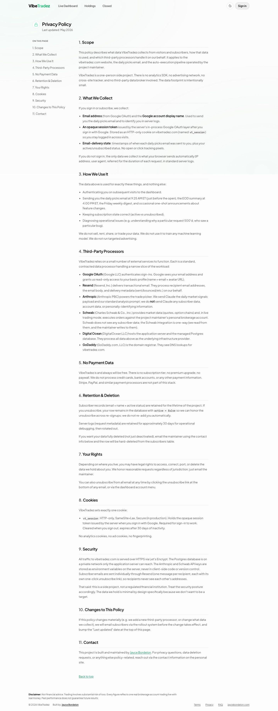 |  |

| Mobile · Light | Mobile · Dark |
|---|---|
| 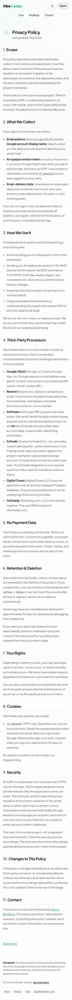 |  |

**User perspective.** Same fixes as terms: AA links, capped measure. The
inline `vt_session` code chips sit tighter against their punctuation after
two padding reductions, with the last ~2px accepted as glyph side bearing
(finding #15).
